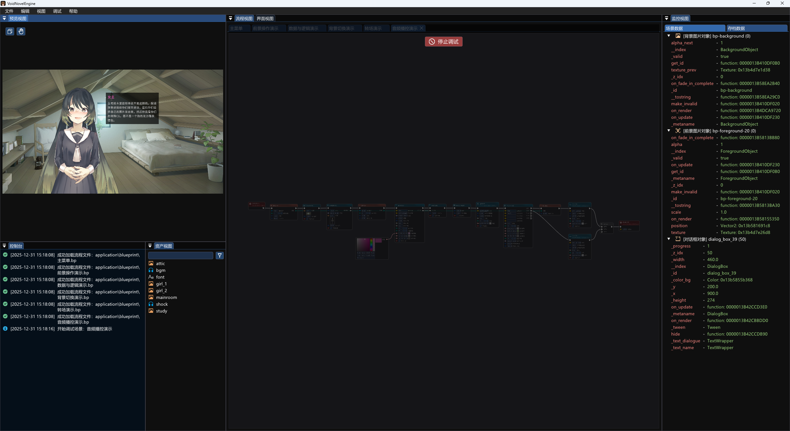
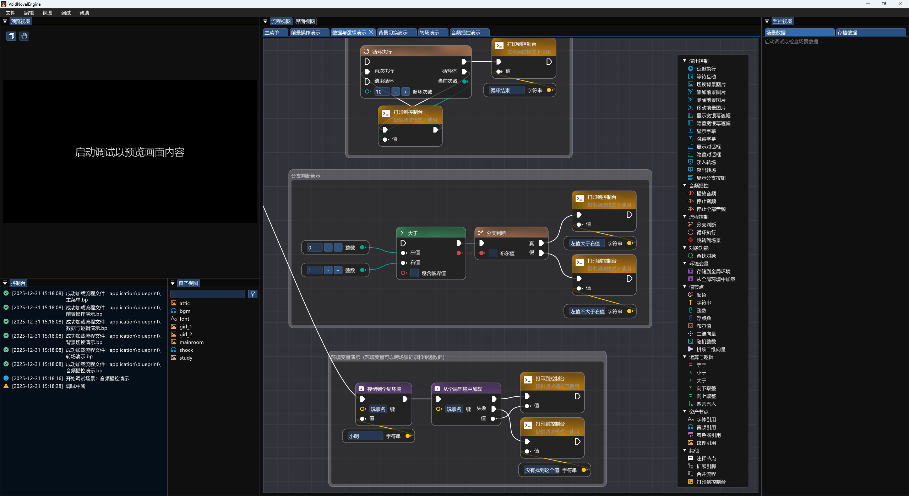

# VoidNovelEngine

    

        
    

    <h1 align="center">VoidNovelEngine</h1>
    
A free, modern engine for visual novels | 自由，现代化的视觉小说引擎

    

        
        
        
        
        
        
        
    

     

> ❗本项目由此前个人实验性项目迁移而来，文档等更多内容仍在建设与规范中，最新代码内容请查看[dev分支](https://github.com/VoidmatrixHeathcliff/VoidNovelEngine/tree/dev)

## 优势特色

VoidNovel Engine 是一款专为现代视觉小说和叙事游戏开发者打造的开源引擎。我们致力于将创意从技术桎梏中解放，让故事讲述回归本源。

#### 🎯 创新性的无代码开发范式
+ **流程图式节点编辑：** 告别晦涩抽象的脚本语言。通过直观的拖拽、连接节点来构建完整的游戏逻辑、分支对话和演出流程，让开发过程如同绘制思维导图一般自然流畅。
+ **为叙事而生：** 编辑器的设计理念深度契合AVG/Galgame的创作逻辑，提供大量开箱即用的专用节点（如对话、选项、转场、角色控制等），让您能专注于情节设计，而非技术实现。

#### ⚙️ 现代化的技术优势
+ **轻量高效，开箱即用：** 引擎本体核心精简，基于C++与Lua构建，提供绿色免安装的完整开发环境，下载即可开始创作，无需复杂配置。
+ **强大的可扩展性：** 引擎架构清晰灵活，您可以轻松创建自定义节点或玩法模块，以满足特定项目的独特需求，在未来我们或将集成AI辅助等先进技术。
+  **现代化渲染支持：** 基于高性能图形库，并计划持续集成现代着色器技术，在保障流畅运行的同时，助力实现富有质感的视觉表现。

#### 👥 开发者友好与协作支持
+ **清晰的错误定位：** 内置友好的错误提示与控制台信息，能快速将问题定位到具体的节点，大幅降低调试难度与时间成本。
+ **面向团队协作的蓝图：** 我们正积极规划面向成熟开发团队的多工种协作功能。未来，编剧、美术、程序等成员将能基于同一平台，使用最适合其职能的工具并行工作。
+ **专注的创作体验：** 引擎专注于解决AVG开发的核心问题，避免了通用游戏引擎的复杂概念，为创作者提供纯净、高效的沉浸式开发环境。

#### 🔓 完全自由与开源承诺
+ **宽松的MIT协议：** 引擎代码完全开源，采用极其宽松的MIT许可证。您可以自由地使用、分发甚至进行商业应用，无需任何额外费用或授权。
+ **透明与可持续：** 项目完全离线工作，本地打包，确保您的项目资产与创作流程完全自主可控，承诺永久免费。

## 软件截图

## 编译构建

VoidNovelEngine工具的二进制版本可在[GitHub发布页面](https://github.com/VoidmatrixHeathcliff/VoidNovelEngine/releases)获取。

### Windows

✅ 在当前的仓库内容中，已经提供了配置完成二进制库文件依赖的[VisualStudio](https://visualstudio.microsoft.com/vs/community/)工程，使用VS2022及以上版本即可在Release配置下生成二进制文件。

### Android

> 🔄 计划中

### macOS

> 🔄 计划中

## 文档教程

> 🚀[最新 dev.2 文档](doc/latest_doc/VNEguide.md)
> 
> 📦[旧版文档目录](doc/old_version_doc/list.md)

## 交流反馈

+ VoidNovelEngine官方1群：[932941346](https://qm.qq.com/q/odwOt62qie)
+ VoidNovelEngine官方2群：[191086491](https://qm.qq.com/q/bvBNOQdMGY)
+ VoidNovelEngine官方3群：[978579458](https://qm.qq.com/q/56LS5seRqg)

## 三方依赖

| 依赖                | 主页                                                                                   |
|:--------------------|:---------------------------------------------------------------------------------------|
| cJSON       | [https://github.com/DaveGamble/cJSON](https://github.com/DaveGamble/cJSON)                     |
| cpp-base64  | [https://github.com/ReneNyffenegger/cpp-base64](https://github.com/ReneNyffenegger/cpp-base64) |
| imgui       | [https://github.com/ocornut/imgui](https://github.com/ocornut/imgui)                           |
| Lua         | [https://www.lua.org/](https://www.lua.org/)                                                   |
| LuaBridge3  | [https://github.com/kunitoki/LuaBridge3](https://github.com/kunitoki/LuaBridge3)               |
| MicroPather | [https://github.com/leethomason/MicroPather](https://github.com/leethomason/MicroPather)       |
| Raylib      | [https://github.com/raysan5/raylib](https://github.com/raysan5/raylib)                         |
| SDL         | [https://github.com/libsdl-org/SDL](https://github.com/libsdl-org/SDL)                         |

## 赞助支持

VoidNovelEngine是一款开源软件，因此你可以免费在MIT开源协议的范畴下使用本软件，并可用于商业使用而无需额外费用或授权。但你的赞助仍可以给予开发者前进的动力，让这个项目变得更好：[赞助名单](doc/sponsor.md)

> **前往赞助：**[爱发电](https://afdian.com/a/Voidmatrix)

## 历史Star

