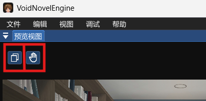
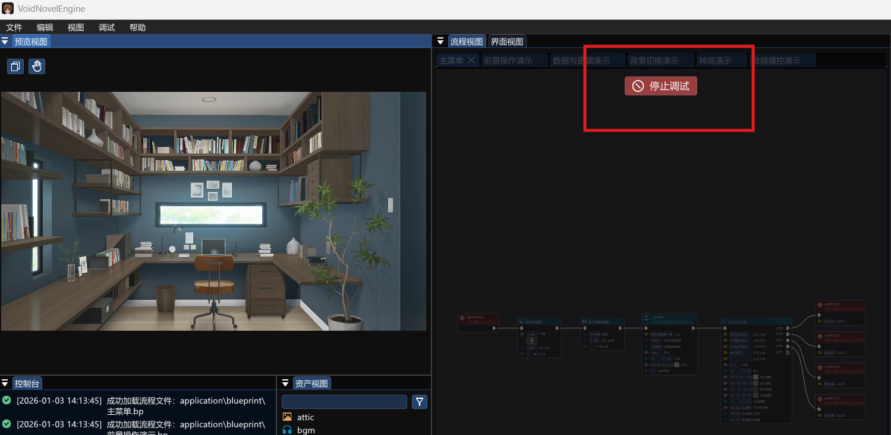
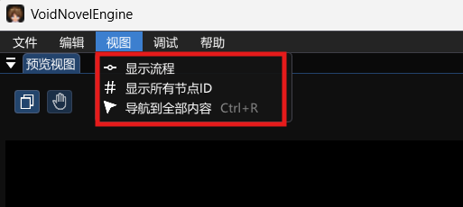
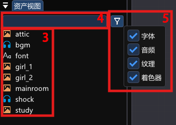
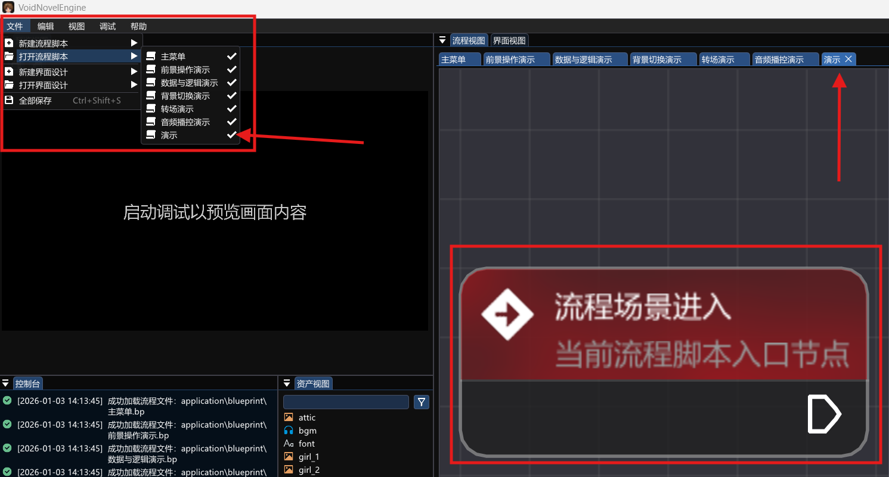
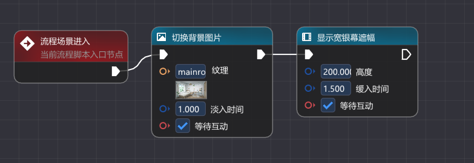
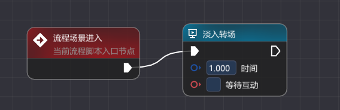

# VoidNovelEngine 游戏开发指引

> [!CAUTION]
>
> **当前引擎版本：0.1.0-dev.1**
>
> 当前版本属于 **开发快照**，部分功能尚未完备，可能存在已知或未知的问题。我们正在持续进行修复与优化，欢迎大家体验并反馈您的宝贵意见。

## 如何开始制作 GAL

### 启动引擎

将我们从 **Github** 或 **视频简介** 下载的 **zip** 文件 **解压**，打开后双击 **VoidNovelEngine.exe** 完成引擎的启动并来到 **主界面**。

  

  

### 引擎界面介绍

根据序号依次介绍引擎组件：

1.  左上方为 **预览视图** 窗口：用于在**调试时**预览当前场景布置的 **人物或背景** 等信息。
2.  左下方为 **控制台** 窗口：用于输出使用引擎时所产生的 **日志** 信息或 **报错** 信息等，方便调试。
3.  控制台窗口右侧为 **资产视图** 窗口：用于存放 **人物、背景、音频等资产**，方便查找资源。
4.  中间部分为 **流程视图** 窗口：用于编辑游戏进程的流程图逻辑窗口，用简单的 **拖拽** 和 **连接** 即可完成游戏逻辑。
5.  右侧部分为 **监控视图** 窗口：针对深度开发者使用，用于显示当前流程图中所有元素的信息。

> [!NOTE]
>
> **注**：如存在按钮或者窗口打开并无显示内容，则为正在施工阶段，请耐心等待。

  

### 启动游戏程序

在引擎主界面处 **按下 F5** 或者在左上方工具栏找到 **调试** 字样再找到 **从当前流程调试** 并点击，即可启动游戏程序，以上提到的所有窗口就会进入 **调试模式** 并开始履行各自的职责。

  

* 在 **画面预览** 窗口左上角有两个图标，鼠标悬停即可得知 **左侧** 为切换至 **独立的大窗口** 进行游戏，而 **右侧** 则是在 **内置的小窗口** 模拟鼠标点击（需启动调试）来推进游戏进程。

  

    
  

* 当我们再点击 **流程视图窗口** 上方的停止调试按钮，即可退出调试模式，也就是退出游戏程序从而继续编写游戏逻辑。

  

    
  

在 **流程视图窗口** 上方有 **主菜单、前景操作演示** 等 **标签栏**，**高亮** 的标签栏即是我们当前所在的流程图场景，通过点击不同的标签栏可以切换不同的流程图场景，此时再按下 **F5** 启动调试，运行的就是当前的流程图场景。

  

**VoidNovelEngine** 内置了很多流程图场景供用户调试和参考，用户可 **自行尝试运行** 各个流程图并在游戏窗口内用鼠标点击进行互动和体验。

还可以在左上方工具栏 **视图** 部分找到以下功能：

*   **显示流程**：即可显示 **当前流程图** 的 **流向图**；
*   **显示所有节点 ID**：可获取当前流程图内所有节点的 ID；
*   **导航到全部内容**（Ctrl+R）：使流程图 **缩放** 到 **足以容纳所有节点的大小**。

更为详细的流程图使用教程将在后面的章节进行详细介绍。

  

### 管理游戏资源

1. 在 **VoidNovelEngine.exe** 文件同级目录下的 **application** 文件夹内的 **resources** 文件夹内，将我们 **人物素材**、**背景素材**、**音效或音乐素材** 导入。

> [!NOTE]
>
> **注**：在 **resources** 文件夹内部如需对文件进行 **增删** 等操作，需要重启引擎来 **刷新** 资产信息，如遇到无法导入的问题，请先参考示例资源的类型。
>
> 由于该版本存在的问题，图片素材仅支持导入 **PNG** 格式，该问题将在下个版本修复。

   

     
   

   

     
   

2. 导入成功后在引擎主界面左下方 **资产视图** 窗口中可以找到我们刚刚导入资源的 **名称** 以及对应类型的 **图标**。

3. 将鼠标 **悬停** 至资源名字上方，同时按住 **左 Alt** 可以 **预览** 纹理、音效等资源。

4. 在该窗口上方 **搜索栏** 中可输入对应资源的名字来进行 **查找** 定位。

5. 搜索栏右侧 **漏斗** 图标可根据资源类型进行 **筛选**。

  

---

### 导出发布

> [!NOTE]
>
> 当前版本暂不支持，该功能将在后续版本发布。

---

## VoidNovelEngine 流程图使用教程

在此之前需要了解的术语：

### 相关术语

#### 1. 基础结构术语

| 专业名词     | 说明                                                   |
| :----------- | :----------------------------------------------------- |
| **流程脚本** | 游戏的逻辑脚本文件，包含具体的流程图。                 |
| **节点**     | 流程脚本的基本组成单元，承载具体的程序功能和编辑功能。 |
| **入口节点** | 每个流程脚本的逻辑起点。                               |

#### 2. 节点构造与连接术语

| 专业名词     | 说明                                                   |
| :----------- | :----------------------------------------------------- |
| **引脚**     | 节点两侧的接口，用于输入输出数据或引导流程走向。       |
| **连线**     | 连接节点之间的线条，代表着流程或数据流向。             |
| **输入引脚** | 节点左侧的引脚，接受上一个节点的执行信号。             |
| **输出引脚** | 节点右侧的引脚，执行完本节点后将信号传递给下一个节点。 |
| **流程引脚** | 节点左右两侧的钻石形引脚，控制游戏流程走向。           |
| **数据引脚** | 节点左右两侧的圆形引脚，用于接收与传递数据。           |

#### 3. 数据类型与参数术语

| 专业名词        | 说明                                                         |
| :-------------- | :----------------------------------------------------------- |
| **纹理**        | 通常用于背景图、前景立绘等的图片资源。                       |
| **布尔值**      | 逻辑值，只有“真 (True)”和“假 (False)”两种状态，常用于判断和勾选框。 |
| **整数**        | 没有小数部分的数字（如 1, 10, -5）。                         |
| **浮点数**      | 带有小数部分的数字（如 3.14, 0.5）。                         |
| **字符串**      | 文本数据（如对话内容、角色名字）。                           |
| **二维向量**    | 包含 X 和 Y 两个数值的数据类型，常用于表示坐标位置或尺寸。   |
| **RGBA**        | 颜色模式，包含红色(R)、绿色(G)、蓝色(B)通道和透明度(A)。     |
| **键 / 值**     | 用于存储数据的成对结构，“键”是名字，“值”是对应的内容。       |
| **左值 / 右值** | 在比较运算（如大于、小于、等于）中，运算符左边和右边的数值。 |

#### 4. 逻辑与环境术语

| 专业名词     | 说明                                             |
| :----------- | :----------------------------------------------- |
| **全局环境** | 存储跨流程图共享数据的区域（全局变量）。         |
| **循环体**   | 在循环节点中，需要被重复执行的那一部分节点序列。 |
| **场景ID**   | 特指流程图脚本的名字，用于跳转场景。             |
| **分支**     | 逻辑的分叉点，根据条件不同执行不同的后续流程。   |
| **等待互动** | 程序暂停执行，直到玩家点击鼠标或按键后才继续。   |

---

### 创建全新的流程图

在左上方工具栏 **文件** 部分找到 **新建流程脚本** 并且输入自己脚本的名字，下方红字检查通过后点击 **创建流程** 即可完成创建。

  

此时我们会发现在 **流程视图** 窗口出现了当前 **流程图场景的开始入口**，即所有逻辑的起点。而在上方的标签栏也出现了刚刚创建的流程图标签。（如果我们此时在上方关闭了该场景，依然可以通过在左上方工具栏 **文件** 部分找到 **打开流程脚本** 来设置我们流程脚本的可见性。）

  

**操作指南：**

* **缩放**：通过 **鼠标滚轮** 可以缩放流程图大小。

* **移动画布**：通过 **按住鼠标右键拖拽** 可移动流程图场景。

* **选择节点**：通过 **鼠标左键悬停** 至节点会高亮该节点，此时 **左键点击** 该节点即可选中。

* **移动节点**：选中后 **按住鼠标左键** 可拖拽移动该节点。

* **删除节点**：选中后 **按下Delete键** 可删除该节点。

* **框选节点**：可使用鼠标左键**框选多个节点**进行移动或删除操作。

* **复制/粘贴节点**：

>[!NOTE]
>
>当前版本暂不支持，该功能将在后续版本发布。

**保存流程：**
当我们使用鼠标左键拖拽节点后，观察该窗口标签栏此流程图的位置，会发现标签右边会出现一个 **白色实心圆**，此时该流程图的状态是 **未保存状态**，即任何在流程图内部的变更操作都会被记录。

  

* 需按下 **Ctrl+S** 来将该流程图 **保存**，**控制台窗口** 就会输出对应保存成功的日志。

* 或通过在左上方工具栏 **文件** 部分找到 **全部保存** 按钮（Ctrl+Shift+S）来将所有未保存的 **流程图场景** 进行保存，直到标签栏所有白色实心圆标志消失。

  

    
  

---

### 流程图节点介绍

在当前流程图场景中 **鼠标右键** 即可弹出创建节点选项，点击第二个 **等待互动节点** 后即可将该节点创建至鼠标位置。

  

观察节点的外观会发现，从上到下依次为该节点的 **图标**、**名称**、**描述** 以及 **背景颜色**。而 **下方钻石形引脚** 则表示流程方向。

  

* **连接规则**：首次创建的节点必须被 **流程图场景的开始入口** 连接。我们回到 **入口处**，拖拽 **右侧钻石形引脚** 至新创建节点的 **左侧钻石形引脚** 上，连线显示为 **绿色**，松开手出现连线即为 **连接成功**；如连线显示为 **红色**，则表示这样的连接 **无效**。

  

    
  

* **取消连接**：点击连接线使连接线高亮，按下 **Delete** 按键即可取消连接。

  

    
  

所有节点的 **左侧箭头都是输入引脚**，**右侧箭头都是输出引脚**。

> [!NOTE]
>
> **从入口节点输出引脚开始依次执行被连接输入引脚的节点，执行被连接了输入引脚的节点后再执行该节点输出引脚连接的下一个节点。**

> [!WARNING]
>
> **注意：** 所有节点的输入引脚与输出引脚 **仅能连接一次**，且 **仅能输出引脚连接输入引脚**（但自身不能连接自身）。

**编辑操作：**
当连接完成后，可以点击选中该节点：

* 使用快捷键 **Ctrl+Z** 可以 **撤销** 操作。

* 使用 **Ctrl+Y** 可以 **重做** 操作。

* 这些操作同样可以在左上方工具栏 **编辑** 部分找到。

  

    
  

---

### 节点功能详细介绍

了解了流程图的工作原理之后，下面将从上到下依次介绍各个节点的 **功能**。

#### 1. 演出控制相关节点

**1. 延迟执行**
当该节点被连接，程序运行到此处会进入 **等待状态**，而下方引脚所设置的秒数即为 **等待时间**。处于等待状态时，场景保持不变，计时结束后将自动执行下一个节点。

  

**2. 等待互动**
当该节点被连接，**且勾选等待互动选项**，程序运行到此处会进入 **等待互动状态**，此时 **点击鼠标左键或空格按键** 才能推进执行下一个节点。如 **没勾选等待互动选项** 则会直接跳过该节点直接执行下一节点。

  

**3. 切换背景图片**
当该节点被连接，首先观察下方引脚，需要输入纹理，此时在此 **输入纹理的名称** 或从 **资产视图窗口** 拖拽纹理至节点 **纹理框** 中即可完成使用。

* 或将窗口中的纹理直接拖拽到流程图中，将该纹理右侧的橙色引脚连接到该节点 **相同颜色** 的引脚上，如纹理框被锁定，即为成功连接该纹理。

* 在 **淡入时间框** 中可控制该纹理淡入的时长。

* 在 **等待互动框** 可勾选是否等待互动。

  

    
  

**4. 添加前景图片**
当该节点被连接，需要传入一张前景图片纹理（例如人物、物品等，该纹理会覆盖至背景上方），此时可调节引脚的各个参数来实现前景纹理的 **缩放、位置** 等参数。

* 该节点右侧为 **对前景图片的操作引脚**，可以通过 **移动前景图片** 和 **删除前景图片** 节点来操作该前景图片。

* 如不手动操作或删除该前景图片，则会一直留在原位置，直到跳转到其他流程图。

  

    
  

**5. 删除前景图片**
当该节点被连接，则需要将 **添加前景图片** 节点 **右侧的前景图片引脚与该节点的前景图片引脚连接**，将前景图片的控制权交给该节点，并在流程控制中在合适的位置接入该节点的输入引脚，来执行该节点的 **删除功能**。

  

**6. 移动前景图片**
当该节点被连接，则需要将 **添加前景图片** 节点 **右侧的前景图片引脚与该节点的前景图片引脚连接**，将前景图片的控制权交给该节点，并在流程控制中在合适的位置接入该节点的输入引脚，来执行该节点的 **移动功能**。

  

**7. 显示宽银幕遮幅**
当该节点被连接，会根据该节点设置的宽银幕的像素 **高度** 和 **缓入时间**，在游戏画面内部显示 **上下两条相同高度黑色遮幅**。

> [!NOTE]
>
> **宽银幕遮幅**常用于营造**”电影感“**，通过上下两条黑色遮蔽来压缩画面范围，让观众注意力向中间集中，从而达到让观众着重关注此处的目的。

* 宽银幕遮幅需要使用 **隐藏宽银幕遮幅** 来隐藏该遮幅，否则会一直存在，直到跳转到其他流程图。

  

    
  

  

    
  

**8. 隐藏宽银幕遮幅**
当该节点被连接，用于隐藏之前生成的 **宽银幕遮幅**。

  

**9.显示字幕**
当该节点被连接，在 **文本框** 输入所要展示的字幕，**字符时间间隔** 为每个字出现的时间间隔，**屏幕底部距离** 为该字幕距离屏幕底部有多少像素距离。**字体框** 需要将 **资产视图** 窗口内的 **font** 文件拖入，设置好 **字号** 以及 **颜色** 等参数，即可显示字幕。

* 该字幕需要 **隐藏字幕** 节点来隐藏该字幕，否则会一直存在，直到跳转到其他流程图。

  

    
  

  

    
  

**10. 隐藏字幕**
当该节点被连接，用于隐藏字幕。

> [!NOTE]
>
> 全局只有一个字幕对象，新连接的 **显示字幕** 节点的字幕文本内容会顶替之前的字幕文本内容，直到流程中连接了 **隐藏字幕** 节点，字幕消失。

  

**11. 显示对话框**
当该节点被连接，在 **角色文本** 输入角色名字，在 **文本内容** 输入对话内容，设置好 **位置**、文本框 **宽度** 等参数，并在 **角色字体** 和 **内容字体** 拖入 **资产视图窗口** 内的 **font** 字体，设置好字号和颜色，即可显示该对话框。

* 该对话框需要 **隐藏对话框** 节点来隐藏对话框，否则会一直存在，直到跳转到其他流程图。

  

    
  

  

    
  

**12. 隐藏对话框**
当该节点被连接，则需要将 **显示对话框** 节点 **右侧的对话框引脚与该节点的对话框引脚连接**，将对话框的控制权交给该节点，并在流程控制中在合适的位置接入该节点的输入引脚，来执行该节点的 **删除功能**。

  

**13. 淡入转场**
当该节点被连接，当前场景会整体淡入显示，**时间** 为 **淡入时间**，**等待互动** 即互动才会触发淡入效果。

> [!NOTE]
>
> **淡入**是影视剪辑中的技巧，作用为**让画面由纯黑逐渐变为完全显示**，常用于影片开场。

  

**14. 淡出转场**
当该节点被连接，当前场景会整体淡出，**时间** 为 **淡出时间**，**等待互动** 即互动才会触发淡出效果。

> [!NOTE]
>
> **淡出**是与淡入相对的剪辑技巧，作用为**让画面由完全显示逐渐变为纯黑**，常用于影片收尾。

  

**15. 显示分支按钮**
当该节点被连接，程序运行至此游戏会 **触发分支选项栏**，在游戏内部点击不同选项会跳转 **该分支选项** 的 **输出引脚**。

* 当该节点被连接，分支文本 1至5 为各个选项的 **内容**，默认颜色为字体颜色，高亮颜色为鼠标悬停选项时所显示的颜色，以及背景颜色和边框颜色，其他选项为调整选项框的间距和位置等元素。

> [!NOTE]
>
> 此版本的分支选项栏的数量是根据最后一个分支文本确定的，如果只填写了 **分支文本1** 和 **分支文本4** ，那么依然会出现 **四个** 分支选项栏，但 **分支选项2** 和 **分支选项3** 文本为空。

  

    
  

  

    
  

---

#### 2. 音频播控相关节点

**1. 音频播放**
当该节点被连接，将 **资产视图窗口** 内的音频文件拖拽至 **音频资产框** 内，可设置该音频循环播放的次数、音量以及淡入时间。当音频文件播放完毕后自动停止。

* 也可以通过 **停止音频** 节点和 **停止全部音频** 节点来手动停止音频。

  

    
  

**2. 停止音频**
当该节点被连接，将 **音频播放** 节点 **右侧的频道引脚与该节点的频道引脚连接**，在流程控制中在合适的位置接入该节点的输入引脚，来执行该节点的 **停止播放功能**。

  

**3. 停止全部音频**
在流程控制中在合适的位置接入该节点的输入引脚，来执行该节点的 **停止全部音频功能**。

  

---

#### 3. 流程控制相关节点

**1. 分支判断**
当该节点被连接，勾选 **布尔值框** 则该节点判断为真，程序会从 **真** 输出引脚输出，否则会从 **假** 输出引脚输出。观察 **布尔值框** 左侧拥有红色引脚，即可以从 **环境变量相关节点** 或 **值节点相关节点** 来更改该节点的布尔值，从而影响分支走向。

  

**2. 循环执行**
当该节点被连接，循环体会根据下方 **循环次数** 来规定右侧 **循环体** 输出引脚到左侧 **再次执行** 输入引脚 **之间的所有节点** 的 **循环运行次数**。

* 若 **达到循环次数** 或左侧 **结束循环** 输入引脚被接入，则会执行该节点的输出引脚连接的下一个节点。

* 右侧循环次数引脚可通过 **其他相关节点** 中的 **打印到控制台** 节点中的 **值** 引脚进行输出打印。

  

    
  

**3. 跳转到场景**
当该节点被连接，程序执行到此节点会根据 **场景 ID** 框内的值，来跳转至其他场景的 **流程场景入口节点** 从而执行另一个流程图的逻辑。而场景 ID 就是该 **流程图的名字**。

  

---

#### 4. 对象功能相关节点

**1. 查找对象**

> [!NOTE]
>
> 属于进阶开发功能，当前版本支持尚不完善，请期待后续版本。

  

---

#### 5. 环境变量相关节点

**1. 存储到全局环境**
当该节点被连接，程序执行到此节点会将 **键** 框内的键值与下方 **值** 引脚接入的值 **配对** 形成键值对存储到全局变量，该全局变量可以 **在任何流程图** 内被 **从全局环境中加载节点** 取出。

  

**2. 从全局环境中加载**
当该节点被连接，程序执行到此节点将会根据下方 **键** 值找到与之配对的 **值** 并从值引脚输出，此节点有两个输出引脚，上方输出引脚为 **寻找值成功** 的走向，失败输出引脚为 **寻找值失败** 的走向。

  

---

#### 6. 值节点相关节点

> [!NOTE]
>
> **值节点**用于便捷编辑参数，当值节点的右侧引脚接入其他节点对应的引脚后，会优先以值节点的参数为准，被连接的引脚参数变为不可修改状态。

**1. 颜色**
可通过调整下方 **RGBA** 或 **十六进制数** 以及 **通过拖动调色盘** 选取颜色。

* 其中 **R 为红色通道，G 为绿色通道，B 为蓝色通道，A 为透明度**，右侧可通过预览窗口来预览当前颜色。

* 该节点可以将右侧 **颜色引脚** 接入例如 **显示字幕节点** 的任何需要颜色输入的节点来控制颜色。

  

    
  

  

    
  

**2. 字符串**
可以将右侧 **字符串引脚** 接入例如 **显示字幕节点** 的任何需要 **文本或字符串** 的位置作为输入。

  

**3. 整数**
可以将右侧 **整数引脚** 接入例如 **显示字幕节点** 的任何需要 **整数或浮点数** 的位置作为输入。

  

**4. 浮点数**
可以将右侧 **浮点数引脚** 接入例如 **显示字幕节点** 的任何需要 **整数或浮点数** 的位置作为输入。

  

**5. 布尔值**
可以将右侧 **布尔值引脚** 接入例如 **显示字幕节点** 的任何需要 **勾选框** 的位置作为输入。

  

**6. 二维向量**
可以将右侧 **二维向量引脚** 接入例如 **添加前景图片节点** 的任何需要例如 **位置**、**按钮内边距** 等成对出现 **值** 的位置作为输入。

  

**7. 随机整数**
当该节点被连接，程序运行至此会随机生成下方 **最小值** 与 **最大值** 之间的一个 **随机值**，该值可通过右侧 **整数引脚** 进行输出。

  

  

**8. 拼装二维向量**
当该节点被连接，下方 **X** 值与 **Y** 值可被接入 **整数** 或 **浮点数** 来拼装成为 **二维向量**，并从 **二维向量引脚输出**。

  

---

#### 7. 运算与逻辑相关节点

**1. 等于**
当该节点被连接，会比较下方引脚接入的 **左值** 以及 **右值** 是否相等，如果相等则会在右侧红色引脚输出 **布尔值 true**，否则会输出 **布尔值 false**。该节点 **可比较的值** 有 **整数、浮点数、布尔值、字符串**，而 **颜色、二维向量** 等比较的是 **对象**。

> [!NOTE]
>
> **颜色，二维向量** 比较时，与它本身相比结果为 **布尔值 true**，与拥有相同值的不同 **对象** 相比为 **布尔值 false**。

  

  

**2. 小于**
当该节点被连接，会比较下方引脚接入的 **左值** 是否小于 **右值**，如果小于则会在右侧红色引脚输出 **布尔值 true**，否则会输出 **布尔值 false**。该节点 **可比较的值** 有 **整数、浮点数** ，可在下方勾选包含临界值来将小于扩展为 **小于等于**。

  

**3. 大于**
当该节点被连接，会比较下方引脚接入的 **左值** 是否大于 **右值**，如果大于则会在右侧红色引脚输出 **布尔值 true**，否则会输出 **布尔值 false**。该节点 **可比较的值** 有 **整数、浮点数** 。可在下方勾选包含临界值来将大于扩展为 **大于等于**。

  

**4. 向下取整**
当该节点被连接，在下方框内输入 **浮点数**，该浮点数会变为 **小于或等于它且最邻近** 的整数从右侧引脚输出。例如 **3.14** 会转换为 **3**。

  

**5. 向上取整**
当该节点被连接，在下方框内输入 **浮点数**，该浮点数会变为 **大于或等于它且最邻近** 的整数从右侧引脚输出。例如 **3.14** 会转换为 **4**。

  

**6. 四舍五入**
当该节点被连接，在下方框内输入 **浮点数**，该浮点数会被 **四舍五入** 为 **整数** 从右侧引脚输出。例如 **3.14** 会转换为 **3**，**3.74** 会转换为 **4**。

  

  

---

#### 8. 资产节点相关节点

**1. 字体引用**
可以将左侧 **资产视图窗口** 内的 **字体资产** 拖入到框内，或在框内输入该字体资产的 **名字** 即可在右侧引脚输出该资产到 **对应引脚位置**。

  

**2. 音频引用**
可以将左侧 **资产视图窗口** 内的 **音频资产** 拖入到框内，或在框内输入该音频资产的 **名字** 即可在右侧引脚输出该资产到 **对应引脚位置**。

  

**3. 着色器引用**

> [!NOTE]
>
> **该功能仍在开发中**，请期待后续版本。

  

**4. 纹理引用**
可以将左侧 **资产视图窗口** 内的 **纹理资产** 拖入到框内，或在框内输入该纹理资产的 **名字** 即可在右侧引脚输出该资产到 **对应引脚位置**。

  

---

#### 9. 其他相关节点

**1. 注释节点**
该节点为辅助节点，创建后可通过拉伸边框调整注释范围，右键左上角注释文字即可编辑注释文字。当拖动该注释节点时，内部所包含的所有节点会跟随移动。

  

**2. 扩展引脚**
当该节点被连接，理论上可以将 **任意类型** 的 **引脚** 接入左侧 **对象引脚**，而右侧三个扩展引脚会全部变为刚才接入引脚的 **对象**，并可以 **输出** 到其他节点的 **对应位置**。

  

**3. 合并流程**
当该节点被连接，左侧有三个流程 **输入引脚**，以及右侧有一个 **输出引脚**，表示 **三条支线** 在此 **合并** 为 **同一个流程**。

  

**4. 打印到控制台**
当该节点被连接，程序运行至此会将 **值** 引脚的值输出至 **控制台窗口**，**值引脚** 理论上可以接收任何引脚。

  

---

## 项目示例演示

请前往此文档查看从 **0** 开发自己的 **Galgame** 的完整项目示例。

> [!NOTE]
>
> 正在施工中。
