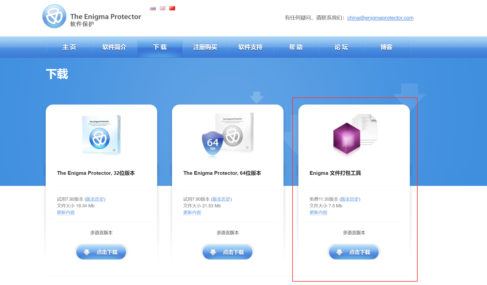
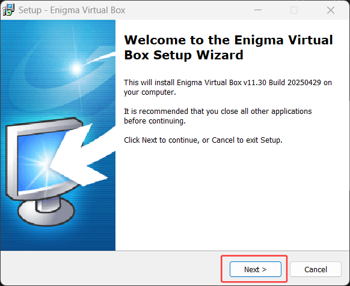
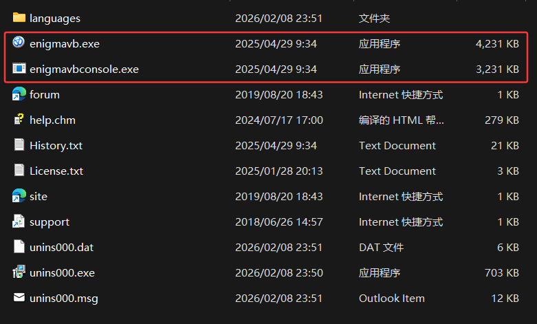
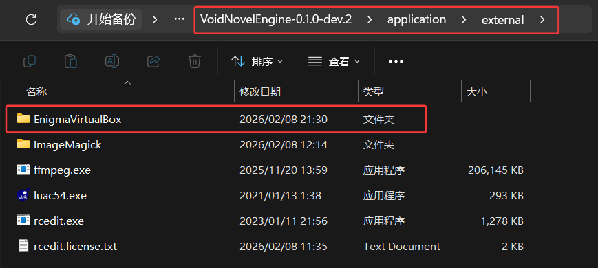
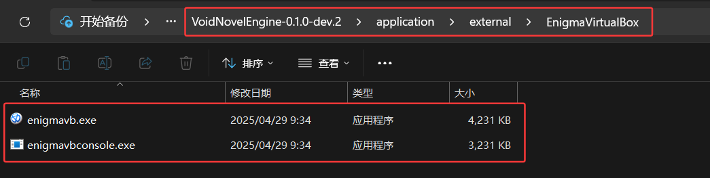

## Enigma Virtual Box（Windows）集成教程

本文档说明如何在 Windows 平台下下载并安装 **Enigma Virtual Box**，并将其可执行程序集成到 **VoidNovelEngine** 中，用于可执行文件封装的相关功能。

------

### 一、下载 Enigma Virtual Box

​	1.打开 Enigma 官方下载页面：https://enigmaprotector.com/cn/downloads.html

​	2.在页面中找到 **Enigma Virtual Box 下载** 区域。

​	3.点击下载 **Enigma 文件打包工具**。

  

------

### 二、安装 Enigma Virtual Box

1. 下载完成后，双击安装程序 **enigmavb.exe**。
2. 安装过程中按照提示操作即可：
   - 一直点击 **Next**。
   - 阅读并同意协议（**Accept / I Agree**）。
   - 设置或使用默认安装路径。
   - 直至安装完成（**Finish**）。

  

------

### 三、获取 Enigma 可执行文件

​	安装完成后，进入 **Enigma Virtual Box** 的安装目录找到以下两个文件：

  

------

### 四、集成到 VoidNovelEngine

​	1.进入 **VoidNovelEngine** 的外部工具目录，在该目录下新建一个文件夹，命名为 **EnigmaVirtualBox**

  

​	2.将 **enigmavb.exe** 与 **enigmavbconsole.exe** 两个执行文件复制到新建文件夹里面即可。

  

------

