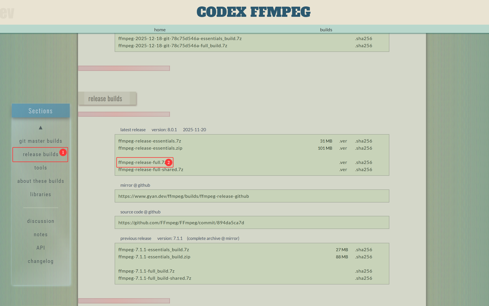
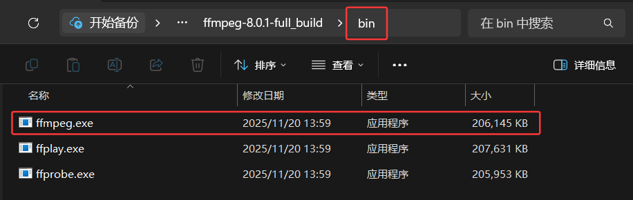
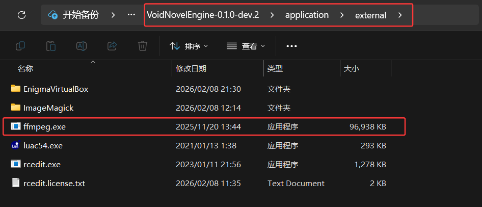

## FFmpeg（Windows）集成教程

本文档说明如何在 Windows 平台下下载并集成 **FFmpeg** 可执行程序（**ffmpeg.exe**）到 **VoidNovelEngine** 中，用于视频处理相关功能。

------

### 一、下载 FFmpeg

​	1.打开 FFmpeg Windows 构建站点：https://www.gyan.dev/ffmpeg/builds/

​	2.在页面中找到 **release builds** 区域。

​	3.点击下载以下文件：**ffmpeg-release-essentials.7z**

  

------

### 二、解压文件

​	1.下载完成后，使用支持 **7z** 格式的解压工具解压该文件。

​	2.解压后进入 **bin** 文件夹找到 **FFmpeg.exe** 文件。

  

------

### 三、拷贝 ffmpeg.exe

​	最后将 **ffmpeg.exe** 文件复制到引擎指定的外部工具目录即可：

  

------

