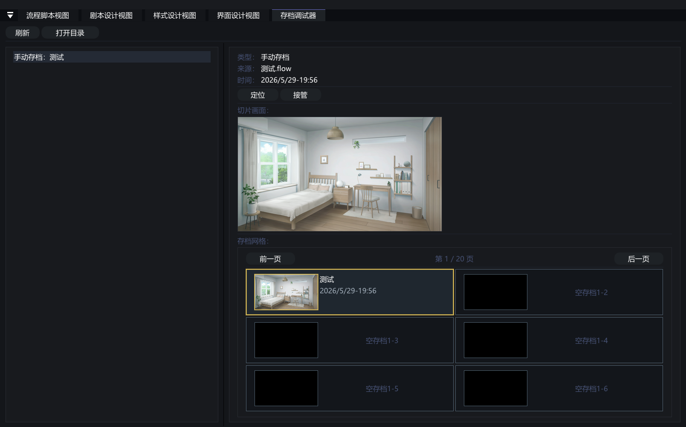

# VoidNovelEngine 存档调试器使用说明

> [!CAUTION]
>
> **适用版本：0.1.0-dev.3**
>
> 本文档介绍 **存档调试器**。是引擎的存档编辑器调试工具。

## 存档调试器是什么

**存档调试器** 用来查看当前项目的存档列表、存档详情和截图预览，并提供定位、接管、删除等调试操作。

  

---

## 界面结构

存档调试器主要由两部分组成：

* **左侧存档列表**：显示当前项目可识别的存档。
* **右侧详情区域**：显示选中存档的来源、时间、截图、流程位置和结构化数据。

底部还提供 **存档网格预览**，方便用接近玩家界面的方式检查槽位显示。

---

## 功能速览

| 功能 | 用途 |
| :--- | :--- |
| **刷新** | 重新扫描当前项目的存档列表。 |
| **打开目录** | 打开当前项目实际使用的存档目录。 |
| **定位** | 跳转到存档对应的 `.flow` 节点或 `.vns` 文本位置。 |
| **接管** | 让运行时进入该存档状态，便于继续调试。 |
| **删除存档** | 删除选中的测试存档，发布前建议清理测试存档。 |
| **存档网格预览** | 按页查看手动、快速或自动存档槽位。 |

---

## 与存档节点的关系

流程图菜单中当前保留的存档节点为：

| 节点 | 用途 |
| :--- | :--- |
| **保存存档** | 保存到指定页码和位置。 |
| **读取存档** | 从指定页码和位置读取。 |
| **快速存档** | 保存到快速存档槽。 |
| **快速读档** | 从快速存档槽读取。 |
| **删除存档** | 删除指定页码和位置的存档。 |

这些节点产生或读取的存档，都可以在存档调试器中检查。

