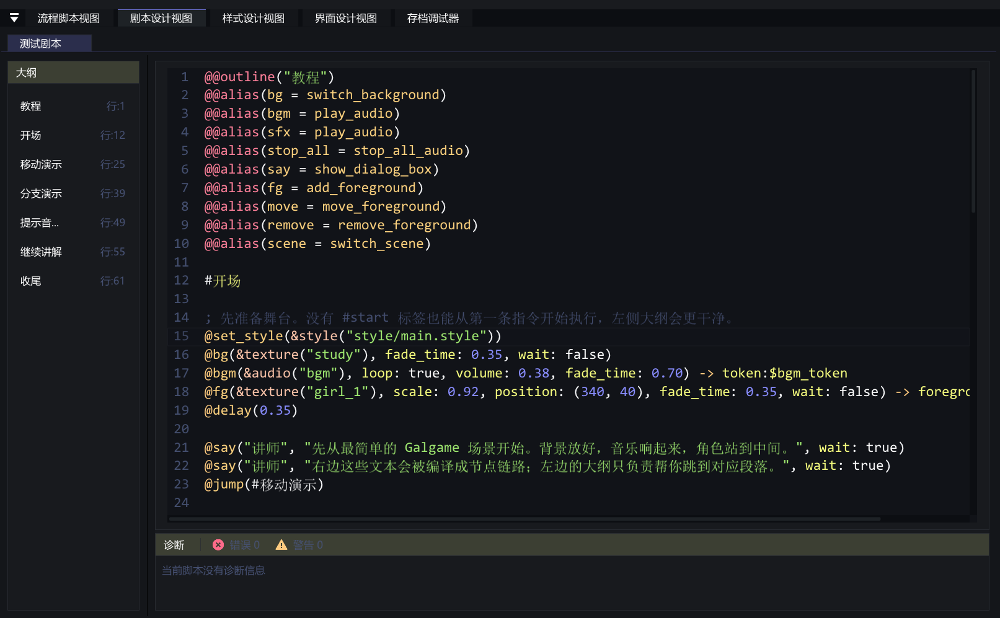
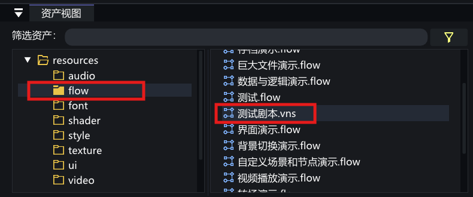

# VoidNovelEngine 剧本设计视图使用说明

> [!CAUTION]
>
> **适用版本：0.1.0-dev.3**
>
> 本文档介绍 Dev3 新增的 **剧本设计视图**，对应资源格式为 **.vns**。

## 剧本设计视图是什么

**剧本设计视图** 用来编辑 **.vns 文本剧本**。它适合把连续剧情、演出命令、分支跳转和资源调用写在同一份文本里，保存后会被编译成引擎可执行的流程结构。

<p align="center">
  
</p>

## 如何打开剧本设计视图

在 **资产视图** 中找到 **.vns** 文件，**双击** 即可打开。如果当前项目还没有文本剧本资源，可以在资产视图中右键创建 **文本剧本**。

> [!NOTE]
>
> **.vns** 和 **.flow** 都位于 `resources/flow` 目录下。区别在于，`.vns` 使用文本语法组织剧情，`.flow` 使用流程图节点组织逻辑。

<p align="center">
  
</p>

## 视图布局说明

剧本设计视图主要由三部分组成：

* **左侧大纲区**：显示 `@@outline` 与 `#标签`，用于快速跳转到剧情段落。
* **中间编辑区**：编辑 `.vns` 文本，支持语法高亮、补全、悬浮提示、查找和替换。
* **下方诊断区**：显示编译错误与警告，方便定位具体行列。

> [!NOTE]
>
> 文本剧本的诊断会尽量指向具体命令、参数、标签或资源引用。遇到报错时，优先查看下方诊断区给出的行号和说明。

## .vns 文件结构

一份 `.vns` 剧本通常按以下顺序组织：

```vns
@@outline("第一章")
@@alias(bg = switch_background)
@@alias(say = show_dialog_box)

#开场
@set_style(&style("style/main.style"))
@bg(&texture("background/study"), fade_time: 0.35, wait: false)

: 这是旁白文本。
老师: 这是角色对白。

@choice()
    - "继续听讲" -> #继续
    - "直接结束" -> #结尾
@end

#继续
@say("老师", "命令可以直接调用节点能力。", wait: true)
@jump(#结尾)

#结尾
@clear_style()
```

执行入口规则如下：

* 如果存在 `#start` 标签，引擎会从 `#start` 开始执行。
* 如果没有 `#start` 标签，引擎会从第一条可执行语句开始执行。
* 空行、注释、`@@` 编译期指令本身不会生成运行时节点。

## 注释

`.vns` 支持两种注释写法：

```vns
; 这是注释
// 这也是注释
```

注释可以放在文件开头、标签之间或命令之间。注释行不会参与编译，也不会影响剧情执行。

## 编译期指令

编译期指令使用 `@@` 开头，必须写在文件开头区域，也就是第一条正式剧情语句之前。

### 大纲标题

```vns
@@outline("教程")
@@outline(title = "教程")
@@outline(name = "教程")
```

`@@outline` 用来设置左侧大纲的文档标题。它只影响编辑器导航，不会生成运行时节点。

### 命令别名

```vns
@@alias(bg = switch_background)
@@alias(bgm = play_audio)
@@alias(say = show_dialog_box)
```

`@@alias(short = target)` 用来给命令设置短名。上面的写法表示后续可以用 `@bg(...)` 代替 `@switch_background(...)`。

> [!NOTE]
>
> 别名名称与目标命令都需要使用英文、数字和下划线，且不能以数字开头。

### 导入其他剧本

```vns
@@import("common/chapter_common")
@@import(target = "common/chapter_common")
@@import(path = "common/chapter_common")
@@import(file = "common/chapter_common")
```

`@@import` 用来导入另一个 **.vns** 文本剧本。导入后，被导入剧本中的标签、命令和别名会参与当前剧本编译。

> [!WARNING]
>
> `@@import` 的目标必须是 `.vns` 文本剧本。导入链路中如果出现循环导入，诊断区会给出错误。

## 标签与跳转

标签使用 `#标签名` 定义：

```vns
#开场
#分支一
#ending_good
```

标签名支持中文、英文、数字和下划线。建议标签名直接表达剧情含义，例如 `#开场`、`#告白失败`、`#结尾`。

跳转使用 `@jump(#标签名)`：

```vns
@jump(#分支一)
```

> [!NOTE]
>
> `@jump` 是文本剧本内置跳转语法，不是普通节点命令。它的目标必须是当前编译结果中存在的标签。

## 文本显示语法

文本剧本中，普通裸文本行不会自动当成旁白。需要显示文本时，请使用下面两种写法。

### 无角色名对白

```vns
: 今晚的风很安静。
```

以 `:` 开头的行会编译为角色名为空的对话框显示。它适合普通旁白，如果需要居中字幕或打字机字幕，请使用 `@show_subtitle(...)`。

### 角色对白

```vns
老师: 接下来演示文本剧本的写法。
```

`角色名: 文本` 会编译为对话框显示。角色名和正文会传给 `show_dialog_box` 节点。

### 直接调用对话命令

```vns
@show_dialog_box("老师", "这是完整命令写法。", wait: true)
@say("老师", "如果设置了别名，也可以这样写。")
```

当需要覆盖位置、字号、字体或颜色时，使用命令写法更清楚。

## 命令语法

命令使用 `@命令名(参数...)`：

```vns
@delay(0.35)
@switch_background(&texture("background/study"), fade_time: 0.35, wait: false)
@play_audio(&audio("bgm/title"), loop_count: -1, volume: 0.6)
```

参数有两种写法：

* **位置参数**：按命令表规定的顺序填写，例如 `@delay(0.35)`。
* **具名参数**：使用 `name: value`，例如 `fade_time: 0.35`。

同一条命令里可以同时使用位置参数和具名参数：

```vns
@say("老师", "这是一句对白。", fade_time: 0.15, wait: true)
```

## 输出绑定

部分命令会产生输出。输出可以绑定到标签或变量。

### 默认流程输出跳转

```vns
@delay(0.35) -> #下一段
```

如果命令有默认流程输出，`-> #标签` 会把默认输出连接到指定标签。

### 指定流程输出跳转

```vns
@save_slot(page: 1, index: 1) -> success:#保存成功 failed:#保存失败
```

当节点有多个流程输出时，可以使用 `输出名:#标签` 指定走向。

### 数据输出保存到变量

```vns
@play_audio(&audio("bgm/title"), loop_count: -1) -> token:$bgm_token
@save_slot(page: 1, index: 1) -> actual_slot_id:$slot_id error_message:$save_error
```

数据输出只能绑定到变量，常见形式为 `$局部变量`、`global.全局变量` 或 `temp.临时变量`。

## 值字面量

`.vns` 支持以下值写法：

| 写法 | 示例 | 说明 |
| :--- | :--- | :--- |
| 字符串 | `"老师"` | 使用英文双引号包裹 |
| 布尔值 | `true` / `false` | 常用于 `wait`、`loop` |
| 空值 | `null` | 表示空值 |
| 整数 | `1` / `-1` | 常用于页码、次数 |
| 浮点数 | `0.35` / `-0.5` | 常用于时间、音量、缩放 |
| 颜色 | `#FFFFFF` / `#FFFFFFFF` | RGB 或 RGBA 十六进制 |
| 二维向量 | `(340, 40)` | 常用于位置 |
| 标签引用 | `#开场` | 常用于跳转 |
| 局部变量 | `$teacher` | 当前剧本运行中的变量 |
| 全局变量 | `global.route.flag` | 可跨流程保存的全局数据 |
| 临时变量 | `temp.choice` | 临时运行数据 |
| 资源引用 | `&texture("study")` | 引用资产视图中的资源 |

> [!NOTE]
>
> 条件表达式支持比较和逻辑运算，但文本剧本表达式目前不写四则运算。需要复杂数值计算时，建议回到流程图中使用运算节点组织。

## 资源引用

资源引用使用 `&类型("定位字符串")`：

```vns
&texture("background/study")
&audio("bgm/title")
&video("op/opening")
&font("font/main")
&shader("shader/soft_light")
&style("style/main.style")
&flow("flow/chapter_01.vns")
&ui("ui/save_panel")
```

可用资源类型如下：

* `texture`：图片纹理资源。
* `audio`：音频资源。
* `video`：视频资源。
* `font`：字体资源。
* `shader`：着色器资源。
* `style`：样式资源。
* `flow`：流程资源，包含 `.flow` 与 `.vns`。
* `ui`：界面资源。

常见组合如下：

```vns
@set_style(&style("style/main.style"))
@switch_background(&texture("background/study"), fade_time: 0.35, wait: false)
@play_audio(&audio("bgm/title"), loop_count: -1, volume: 0.5) -> token:$bgm
@show_ui(&ui("ui/quick_menu"))
@scene("flow/chapter_02.vns")
```

> [!NOTE]
>
> 资源定位字符串建议使用资产视图中显示的资源 ID 或资源路径。编辑器补全会优先帮助选择当前资源索引中存在的资源。
> 流程切换目标需要写完整资源路径并保留后缀，例如 `flow/chapter_02.vns` 或 `flow/main_menu.flow`，不要再写 `@scene("主菜单")` 这种短名。

## 条件结构

条件分支使用 `@if`、`@elif`、`@else`、`@end`：

```vns
@if(global.route == "A")
    @jump(#路线A)
@elif(global.route == "B")
    @jump(#路线B)
@else
    @jump(#默认路线)
@end
```

条件表达式支持：

* 比较：`==`、`!=`、`>`、`<`、`>=`、`<=`
* 逻辑：`and`、`or`、`not`
* 括号：`( ... )`
* 可比较的值：变量、字符串、数字、布尔值、`null`

示例：

```vns
@if($teacher != null and global.chapter >= 2)
    @say("老师", "这个角色已经登场。")
@end
```

## 选项结构

选项分支使用 `@choice()` 块：

```vns
@choice()
    - "听一下提示音" -> #提示音分支
    - "直接继续" -> #继续讲解
@end
```

每个选项使用 `- "选项文本" -> #标签`。当前内置选项按钮最多支持 **5 个选项**。

> [!WARNING]
>
> `@choice(prompt: "...")` 这类提示参数目前不会被内置选项按钮使用。需要提示语时，建议在 `@choice()` 前先写一条对白或字幕。

## 内置命令总表

下面列出当前可在 `.vns` 中直接使用的内置命令。表格中的 `[]` 表示可选参数。

### 流程控制

| 命令 | 常用写法 | 说明 |
| :--- | :--- | :--- |
| `@jump` | `@jump(#标签)` | 跳转到当前剧本或导入剧本中的标签 |
| `@switch_scene` / `@scene` | `@scene("flow/chapter_02.vns")` | 切换到另一个 `.flow` 或 `.vns` 流程资源 |
| `@node` | `@node(type: "节点type_id", 参数名: 值)` | 高级写法，按节点 type_id 直接创建节点 |

### 演出控制

| 命令 | 常用写法 | 说明 |
| :--- | :--- | :--- |
| `@delay` / `@wait` | `@delay(0.35)` | 延迟指定秒数后继续 |
| `@wait_interaction` | `@wait_interaction(true)` | 等待玩家点击或按空格 |
| `@switch_background` / `@bg` | `@bg(&texture("study"), fade_time: 0.35, wait: false)` | 切换背景图 |
| `@add_foreground` / `@fg_add` | `@add_foreground(&texture("girl"), scale: 0.92, position: (340, 40)) -> foreground:$girl` | 添加前景或立绘 |
| `@move_foreground` / `@fg_move` | `@move_foreground($girl, (660, 40), 0.28, wait: false)` | 移动前景对象 |
| `@remove_foreground` / `@fg_remove` | `@remove_foreground($girl, 0.3, wait: false)` | 移除前景对象 |
| `@show_dialog_box` / `@say` | `@say("老师", "对白内容。", wait: true)` | 显示对话框 |
| `@show_subtitle` / `@subtitle` | `@subtitle("旁白内容。", char_interval: 0.02)` | 显示居中字幕 |
| `@show_choice_button` | `@show_choice_button(choice_text_1: "A") -> choice_1:#A` | 直接显示选项按钮，通常优先使用 `@choice()` 块 |
| `@play_video` / `@video` | `@video(&video("op/opening"), volume: 1.0)` | 播放全屏视频 |
| `@show_ui` / `@open_ui` | `@show_ui(&ui("ui/quick_menu"))` | 显示界面后立即继续流程 |
| `@call_ui` / `@call_screen` | `@call_ui(&ui("ui/save_panel"))` | 显示界面并等待它关闭 |
| `@close_ui` / `@hide_ui` | `@close_ui(&ui("ui/save_panel"))` | 关闭指定界面；在界面事件流程中可省略参数关闭当前界面 |

### 音频控制

| 命令 | 常用写法 | 说明 |
| :--- | :--- | :--- |
| `@play_audio` / `@audio` / `@sound` | `@audio(&audio("bgm/title"), loop_count: -1, volume: 0.6) -> token:$bgm` | 播放音频并输出播放令牌 |
| `@stop_audio` / `@audio_stop` | `@stop_audio($bgm, fade_time: 0.5)` | 停止指定播放令牌对应的音频 |
| `@stop_all_audio` / `@audio_stop_all` | `@stop_all_audio(0.5)` | 停止当前所有音频 |

> [!NOTE]
>
> `loop_count: -1` 表示无限循环。`loop: true` 也可以作为快捷写法传给 `play_audio`。

### 样式控制

| 命令 | 常用写法 | 说明 |
| :--- | :--- | :--- |
| `@set_style` | `@set_style(&style("style/main.style"))` | 设置当前激活样式 |
| `@clear_style` | `@clear_style()` | 清空当前激活样式，回到默认表现 |

### 存档系统

| 命令 | 常用写法 | 说明 |
| :--- | :--- | :--- |
| `@save_slot` | `@save_slot(page: 1, index: 1) -> success:#保存成功 failed:#保存失败` | 保存到指定手动存档页与位置 |
| `@quick_save` | `@quick_save() -> success:#保存成功 failed:#保存失败` | 写入快速存档 |
| `@load_slot` | `@load_slot(page: 1, index: 1) -> failed:#读取失败` | 读取指定手动存档；成功后会切换到存档运行时 |
| `@quick_load` | `@quick_load() -> failed:#读取失败` | 读取快速存档；成功后会切换到存档运行时 |
| `@delete_slot` | `@delete_slot(page: 1, index: 1) -> success:#删除成功 failed:#删除失败` | 删除指定手动存档 |

存档命令常见的数据输出如下：

```vns
@save_slot(page: 1, index: 1) -> actual_slot_id:$slot_id error_message:$save_error
@quick_save() -> slot_id:$quick_slot error_message:$save_error
@load_slot(page: 1, index: 1) -> error_message:$load_error
@quick_load() -> error_message:$load_error
@delete_slot(page: 1, index: 1) -> error_message:$delete_error
```

> [!WARNING]
>
> `load_slot` 与 `quick_load` 读取成功后会直接切换到目标运行时，不会再从当前节点继续往后执行。只有读取失败时，才会沿 `failed` 输出继续。

## 命令参数速查

参数表中的第一组参数通常可以按位置填写，也可以改成具名参数填写。输出名用于 `-> 输出名:#标签` 或 `-> 输出名:$变量`。

| 命令 | 参数 | 输出 |
| :--- | :--- | :--- |
| `@jump` | `target`：标签引用，例如 `#开场` | 无 |
| `@switch_scene` / `@scene` | `target`：流程资源或流程定位字符串 | 无，执行后切换到目标流程 |
| `@delay` / `@wait` | `seconds` | `out` |
| `@wait_interaction` | `wait` | `out` |
| `@switch_background` / `@bg` | `texture`、`shader`、`fade_time`、`wait` | `out` |
| `@add_foreground` | `texture`、`shader`、`scale`、`position`、`fade_time`、`wait` | `out`、`foreground` |
| `@move_foreground` | `foreground`、`position`、`duration`、`wait` | `out` |
| `@remove_foreground` | `foreground`、`fade_time`、`wait` | `out` |
| `@show_dialog_box` / `@say` | `role`、`text`、`position`、`width`、`fade_time`、`role_font`、`dialogue_font`、`role_font_size`、`dialogue_font_size`、`role_color`、`dialogue_color`、`background_color`、`wait` | `out`、`dialog_box` |
| `@show_subtitle` / `@subtitle` | `text`、`char_interval`、`bottom_distance`、`font`、`font_size`、`color`、`wait` | `out` |
| `@show_choice_button` | `choice_text_1` 到 `choice_text_5`、`font`、`font_size`、`text_color`、`hover_color`、`background_color`、`border_color`、`button_spacing`、`button_padding`、`bottom_distance`、`minimum_width` | `choice_1` 到 `choice_5` |
| `@play_video` / `@video` | `video`、`volume`、`shader` | `out` |
| `@show_ui` / `@open_ui` | `ui` | `out` |
| `@call_ui` / `@call_screen` | `ui` | `out`，界面关闭后继续 |
| `@close_ui` / `@hide_ui` | `ui`，在界面事件流程中可省略 | `out` |
| `@play_audio` / `@audio` | `audio`、`loop_count`、`volume`、`fade_time` | `out`、`token` |
| `@stop_audio` | `token`、`fade_time` | `out` |
| `@stop_all_audio` | `fade_time` | `out` |
| `@set_style` | `style` | `out` |
| `@clear_style` | 无 | `out` |
| `@save_slot` | `page`、`index` | `success`、`failed`、`actual_slot_id`、`error_message` |
| `@quick_save` | 无 | `success`、`failed`、`slot_id`、`error_message` |
| `@load_slot` | `page`、`index` | `failed`、`error_message` |
| `@quick_load` | 无 | `failed`、`error_message` |
| `@delete_slot` | `page`、`index` | `success`、`failed`、`error_message` |
| `@node` | `type` 必填，其余参数按目标节点引脚 key 填写 | 按目标节点输出引脚决定 |

常见参数别名如下：

| 原参数 | 可用别名 | 适用命令 |
| :--- | :--- | :--- |
| `fade_time` | `duration` | `switch_background`、`add_foreground`、`remove_foreground`、`stop_audio`、`stop_all_audio` |
| `fade_time` | `fade_in` | `play_audio` |
| `loop_count` | `loop` | `play_audio`，可写 `loop: true` |
| `wait` | `wait_interaction` | 背景、前景、移动、移除、对白、字幕等演出命令 |
| `target` | `scene_id` | `switch_scene` |
| `role` | `name` | `show_dialog_box` |
| `text` | `dialogue` | `show_dialog_box` |
| `foreground` | `target` | `move_foreground`、`remove_foreground` |
| `position` | `target_position` | `move_foreground` |

## 常见结构

### 开场初始化

```vns
@@outline("第一章")
@@alias(bg = switch_background)
@@alias(bgm = play_audio)
@@alias(say = show_dialog_box)

#start
@set_style(&style("style/main.style"))
@bg(&texture("background/study"), fade_time: 0.35, wait: false)
@bgm(&audio("bgm/title"), loop: true, volume: 0.45, fade_time: 0.7) -> token:$bgm
@jump(#正文)
```

### 立绘登场与移动

```vns
#正文
@add_foreground(&texture("character/girl_1"), scale: 0.92, position: (340, 40), fade_time: 0.35, wait: false) -> foreground:$girl
@say("老师", "角色对象可以保存到变量里，后续继续移动或移除。")

@move_foreground($girl, (660, 40), 0.28, wait: false)
@delay(0.32)
@move_foreground($girl, (340, 40), 0.28, wait: false)
```

### 分支选择

```vns
#分支
@say("老师", "接下来由玩家选择路线。")

@choice()
    - "进入路线 A" -> #路线A
    - "进入路线 B" -> #路线B
@end
```

### 条件合流

```vns
#路线A
@say("老师", "这是路线 A。")
@jump(#合流)

#路线B
@say("老师", "这是路线 B。")
@jump(#合流)

#合流
@if(global.has_key == true)
    @say("老师", "你已经取得钥匙。")
@else
    @say("老师", "你还没有钥匙。")
@end
```

### 调用界面

```vns
#打开存档界面
@call_ui(&ui("ui/save_panel"))
@say("系统", "界面关闭后，流程会从这里继续。")
```

如果只需要显示快捷菜单或 HUD，不需要流程停下来等待，使用 `show_ui`：

```vns
@show_ui(&ui("ui/quick_menu"))
```

### 切换到其他流程

```vns
#下一章
@stop_all_audio(0.5)
@clear_style()
@scene("flow/chapter_02.vns")
```

### 存档失败处理

```vns
#自动保存
@quick_save() -> success:#保存完成 failed:#保存失败 error_message:$save_error

#保存完成
@say("系统", "自动保存完成。")
@jump(#继续)

#保存失败
@say("系统", $save_error)
@jump(#继续)
```

## 与流程图如何配合

Dev3 中，**文本剧本** 和 **流程图** 可以共存。建议按职责拆分：

1. **文本剧本** 负责连续剧情、对白、演出节奏、章节内分支。
2. **流程图** 负责复杂系统逻辑、数值计算、界面事件和需要大量节点协作的结构。
3. 两者之间通过 **跳转到场景**、`.flow / .vns` 资源引用和界面事件流程连接。

当剧情以文本为主时，可以把一章写成一个 `.vns`；当系统逻辑明显多于对白时，使用 `.flow` 会更直观。
