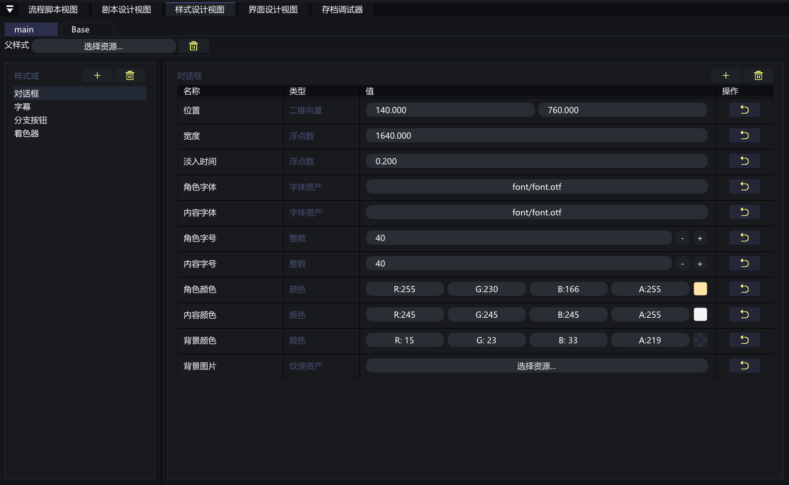
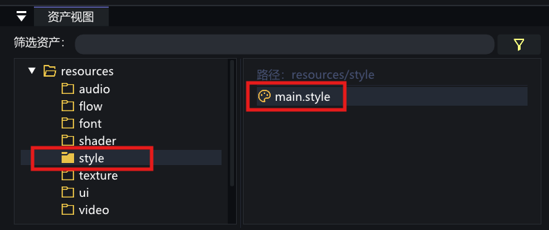
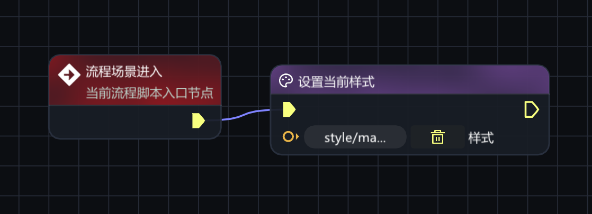
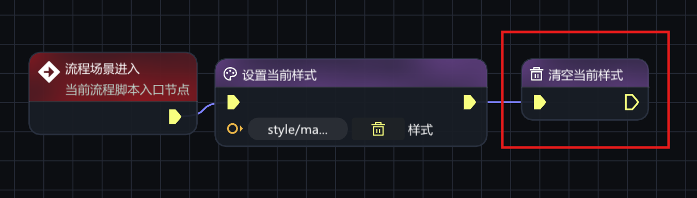
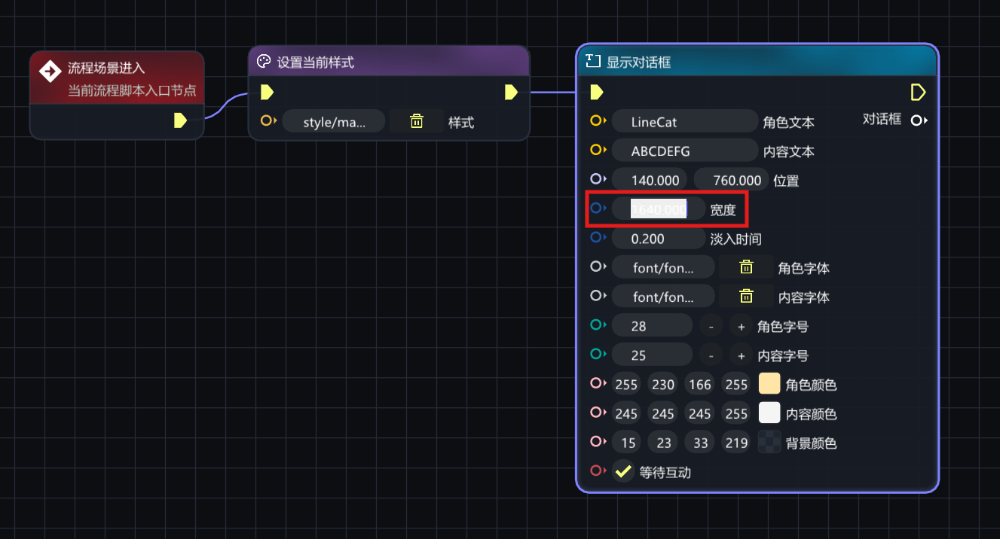
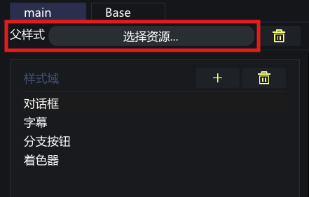
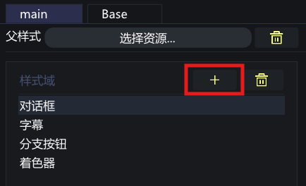
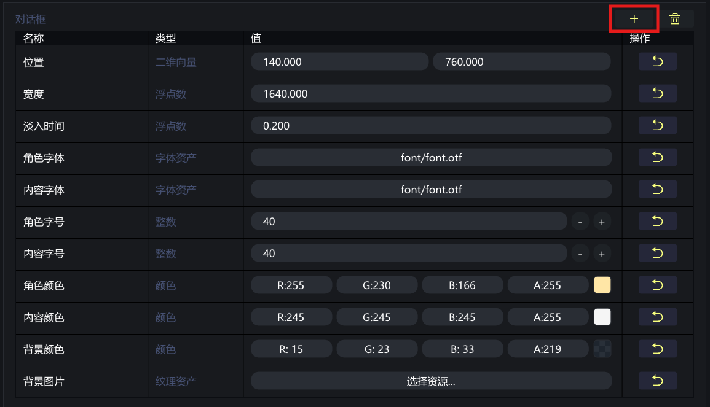

# VoidNovelEngine 样式设计视图使用说明

> [!CAUTION]
>
> **适用版本：0.1.0-dev.3**
>
> 本文档介绍 **样式设计视图**，对应资源格式为 **.style**。

## 样式设计视图是什么

**样式设计视图** 用来编辑游戏运行时的统一视觉样式。它主要管理对话框、字幕、分支按钮和着色器等公共外观，把全局样式集中放在一个 `.style` 文件里维护。

<p align="center">
  
</p>
----

## 如何打开样式设计视图

在 **资产视图** 中找到 **.style** 文件，**双击** 即可打开。如果当前项目还没有样式资源，可以在资产视图中右键创建 **样式**。

<p align="center">
  
</p>
---


## 视图结构

样式设计视图主要由三部分组成：

* **左侧样式域列表**：显示当前样式文件里的样式域，例如对话框、字幕、分支按钮、着色器。
* **右侧字段编辑区**：编辑当前样式域下的字段值，例如字体、字号、颜色、位置、背景图片。
* **父样式设置**：指定一个父样式，让当前样式只覆盖需要改动的字段。

> [!NOTE]
>
> 如果某个字段没有填写，运行时会优先从父样式或内置默认值中寻找可用配置。

---

## 样式域速览

默认提供以下样式域：

| 样式域 | 用途 |
| :--- | :--- |
| **对话框** | 控制角色名、正文、位置、宽度、字体、字号、颜色、背景图片和淡入时间。 |
| **字幕** | 控制字幕字体、字号、颜色、底部距离和字符显示间隔。 |
| **分支按钮** | 控制选项按钮的字体、颜色、背景、边框、间距、内边距和最小宽度。 |
| **着色器** | 为背景、前景、视频和全局后处理指定默认着色器。 |

---

## 核心操作

### 设置当前样式

在流程图中使用 **设置当前样式** 节点，选择需要启用的 `.style` 文件。启用后，后续对话框、字幕、分支按钮等节点会优先读取当前样式。

<p align="center">
  
</p>

在 `.vns` 文本剧本中也可以这样写：

```vns
@set_style(&style("style/main.style"))
```

---

### 清空当前样式

如果某段剧情需要回到默认外观，可以使用 **清空当前样式** 节点。

<p align="center">
  
</p>

在 `.vns` 文本剧本中也可以这样写：

```vns
@clear_style()
```

---

### 覆盖单个节点参数

样式只提供默认值。单个节点上手动填写的参数，会优先于当前样式生效。

例如某句对话想临时改变位置或宽度，可以直接在 **显示对话框** 节点上填写对应字段，不需要新建一份样式。

<p align="center">
  
</p>

---

## 父样式与继承

父样式适合做“基础皮肤”：

1. 建一个 `Base.style`，写好通用字体、字号、颜色。
2. 再建一个 `Chapter_01.style`，把父样式设为 `Base.style`。
3. 在 `Chapter_01.style` 中只改本章节需要变化的字段。

这样可以避免每个样式文件都重复填写同一批字段。

<p align="center">
  
</p>

---

## 自定义样式域与字段

在 `.style` 中 **点击加号** 创建自定义样式域和自定义字段。它主要面向扩展开发：

* 自定义节点可以读取自定义样式字段。
* 自定义场景可以根据自定义样式域绘制自己的界面。
* 自定义字段应使用清晰、稳定的英文 key，避免后续资源迁移时难以维护。

> [!NOTE]
>
> 普通项目优先使用内置样式域。只有在自定义节点、界面或场景确实需要共享外观配置时，再增加自定义样式字段。

<p align="center">
  
</p>

<p align="center">
  
</p>
---

### 添加自定义样式域

在左侧样式域列表中点击 **添加样式域**，只需要填写 **域名称**。

| 项目 | 说明 |
| :--- | :--- |
| **域名称** | 左侧列表中显示的样式域名称，例如 `战斗界面`、`BattleUI`。 |

确认后，左侧会出现新的样式域。域名称主要用于分组管理，具体给程序读取的 key 放在右侧字段里填写。

---

### 添加自定义字段

选中自定义样式域后，在右侧字段区域点击 **添加字段**，填写：

| 项目  | 说明 |
| :--: | :--- |
| **内部标识** | 程序读取时使用的字段 key，建议使用英文、数字和下划线，例如 `hp_bar_color`、`title_font`、`panel_texture`。 |
| **名称** | 编辑器里显示给制作者看的字段名称，例如 `血条颜色`、`标题字体`、`面板纹理`。 |
| **字段类型** | 决定字段可以填写什么值，例如数字、字符串、颜色、纹理、字体、着色器等。 |
| **字段值** | 当前样式实际保存的默认值。 |

> [!WARNING]
>
> 自定义字段的内部标识一旦被自定义节点或自定义场景使用，就不要随意改名。改名后，旧逻辑可能读不到原来的样式值。
