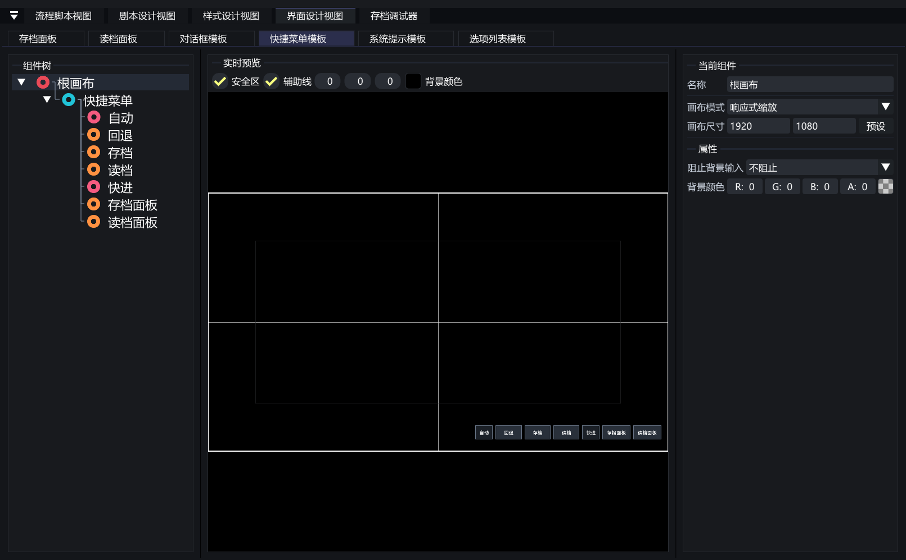
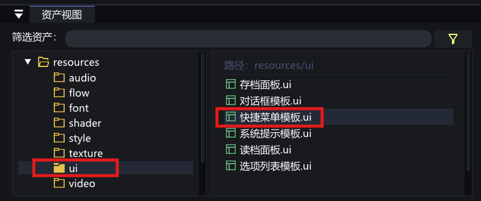
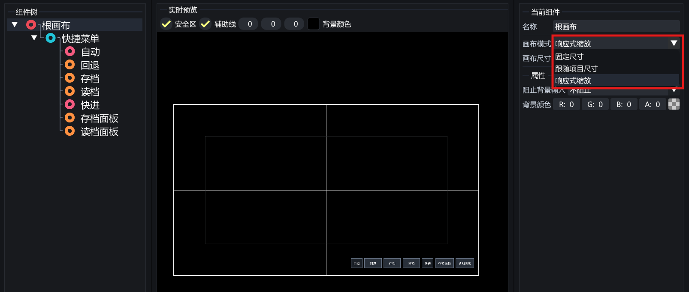
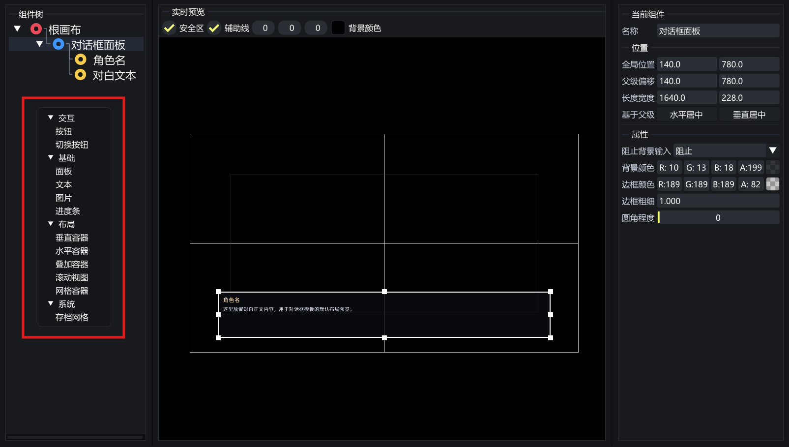
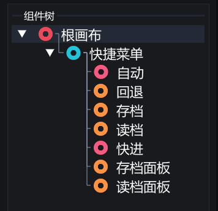
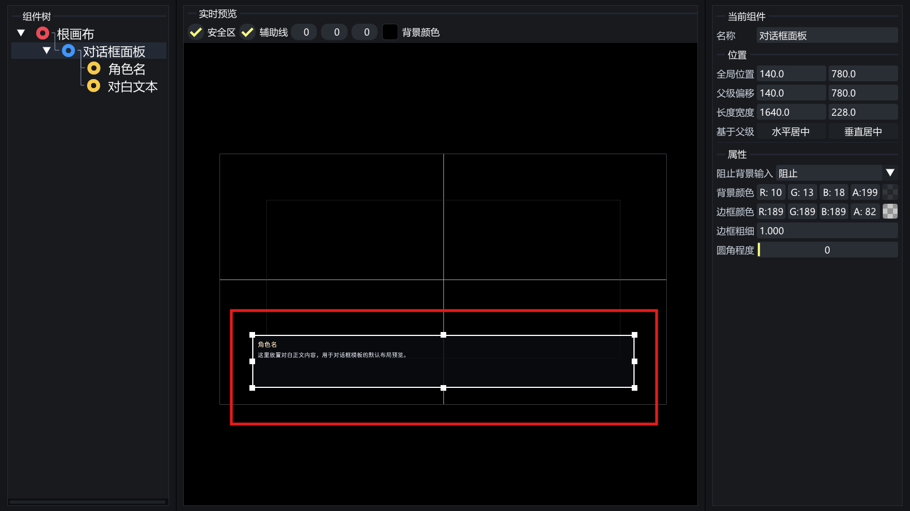
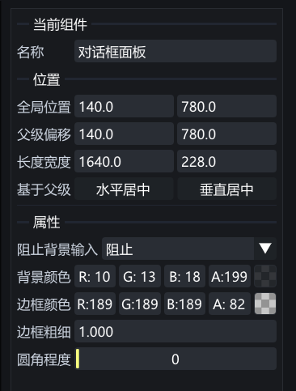
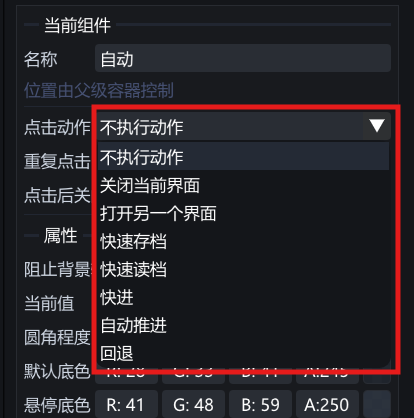
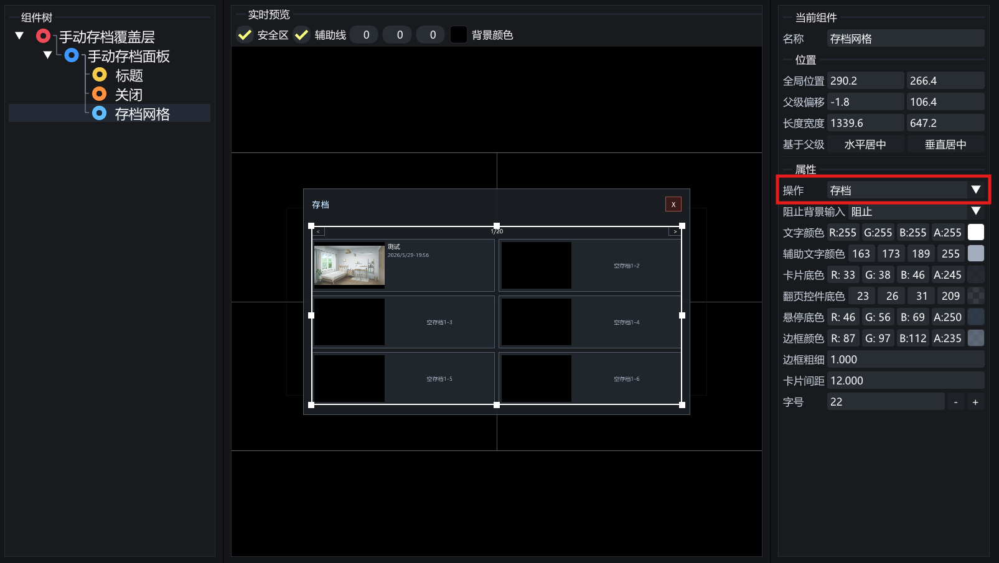

# VoidNovelEngine 界面设计视图使用说明

> [!CAUTION]
>
> **适用版本：0.1.0-dev.3**
>
> 本文档介绍 **界面设计视图**，对应资源格式为 **.ui**。

## 界面设计视图是什么

**界面设计视图** 用来制作运行时界面。可以制作主菜单、快捷菜单、读档面板、存档面板等可复用 UI。

`.ui` 资源本身只描述界面结构和交互动作。什么时候显示、什么时候关闭，通常由流程图节点控制。

  

---

## 如何打开界面设计视图

在 **资产视图** 中找到 **.ui** 文件，**双击** 即可打开。如果当前项目还没有界面资源，可以在资产视图中右键创建 **界面**。

  

---

## 视图结构

界面设计视图主要由三部分组成：

* **组件树**：管理界面里的所有组件层级。
* **中间预览区**：直接查看和调整组件在画布中的位置、尺寸与层级关系。
* **属性面板**：编辑选中组件的布局、外观、文本、资源和交互动作。

---

## 根画布

每个 `.ui` 文件都有一个根画布。根画布决定这份界面的设计尺寸、缩放方式和背景输入处理。

| 画布模式 | 说明 |
| :--- | :--- |
| **固定尺寸** | 按当前 UI 文件自己的画布尺寸设计。 |
| **跟随项目尺寸** | 使用项目设置中的画布尺寸。 |
| **响应式缩放** | 按设计尺寸缩放到运行时画面。 |

  

---

## 常用组件

| 类型 | 组件 | 主要用途 |
| :--- | :--- | :--- |
| **基础显示** | 面板、文本、图片 | 搭建背景、标题、说明文字和图片展示。 |
| **交互控件** | 按钮、切换按钮、进度条 | 制作菜单按钮、开关项、音量条或状态显示。 |
| **存档控件** | 存档网格 | 制作手动存档、读档和存档列表界面。 |
| **布局容器** | 垂直容器、水平容器、叠加容器、滚动视图、网格容器 | 组织组件排列，减少手工对齐。 |

  

---

## 核心操作

### 编辑组件树

在组件树中可以创建子组件、调整层级、复制粘贴、删除组件。组件的父子关系会影响布局和绘制顺序。常见做法是先放一个 **面板** 或 **容器**，再把按钮、文本、图片挂到里面。

  

---

### 调整预览区

在预览区中选中组件后，可以拖动位置、调整尺寸，并根据辅助线检查对齐关系。适合处理按钮组、面板边距和存档网格区域。

  

---

### 修改属性

属性面板按布局、外观、文本、交互等分组显示。常用字段包括：

* **锚点与偏移**：决定组件在画布中的位置和尺寸。
* **可见与透明度**：控制组件是否显示，以及整体透明度。
* **字体、字号、颜色**：控制文本和按钮显示。
* **背景、边框、图片资源**：控制面板、按钮和图片外观。
* **阻止背景输入**：控制 UI 被点击时，是否继续把输入传给后方剧情画面。

  

---

## 按钮点击动作

按钮和切换按钮可以设置点击动作。常用动作如下：

| 动作 | 用途 |
| :--- | :--- |
| **无动作** | 只保留界面事件，不直接执行内置操作。 |
| **关闭当前界面** | 关闭当前打开的 UI。 |
| **打开界面** | 从一个界面跳到另一个界面。 |
| **快速存档 / 快速读档** | 调用项目当前的快速存读档逻辑。 |
| **快进 / 自动推进 / 回退** | 控制运行时剧情推进方式。 |
| **打开存档面板 / 打开读档面板** | 打开项目设置中指定的存档或读档界面。 |

> [!NOTE]
>
> 如果按钮只负责触发流程图逻辑，可以把点击动作保持为 **无动作**，再在流程图中使用 **组件被点击** 节点接收事件。

  

---

## 存档网格

**存档网格** 用来显示手动存档槽位。它可以设置：

* **操作**：保存或读取。
* **卡片间距、字号、边框、底色、悬停底色**。

制作读档面板时，把存档网格的操作设为 **读档**；制作存档面板时，把操作设为 **存档**。页数和每页槽位数量由项目当前存档配置决定，不在存档网格组件里单独调整。

  

---

## 与流程图如何配合

流程图中常用以下节点接入 UI：

| 节点 | 用途 |
| :--- | :--- |
| **显示界面** | 打开 UI 后继续执行后续流程，适合 HUD、快捷菜单、常驻覆盖层。 |
| **调用界面** | 打开 UI 并等待它结束，适合菜单、确认框、存档读档面板。 |
| **关闭界面** | 主动关闭某个已打开的 UI。 |
| **界面打开后 / 界面关闭后** | 监听界面生命周期。 |
| **组件被点击 / 组件悬停时 / 组件离开时** | 监听组件交互事件。 |

---
