# 你的第一个 AVG 游戏！

> [!NOTE]
>
> **当前引擎版本：0.1.0-dev.1**
>
> 本游戏开发演示属于基本流程演示，并不代表引擎的全部功能，欢迎大家探索出更丰富更有趣的玩法。

**完整项目概览**

  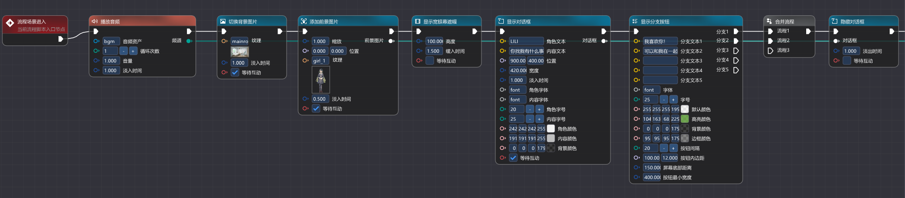
    
  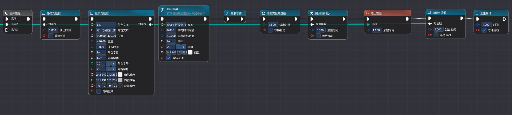

## 从 0 创建和编辑节点

本教程示例将完整展示具备完整叙事逻辑的 **AVG** 片段，内容涵盖 **场景搭建**，**交互逻辑** 以及 **画面元素增删**。

#### 1. 创建全新的流程图

首先，在左上方工具栏找到 **文件** -> **新建流程脚本**，输入名字创建后，你会看到画布上自动生成了一个 **入口节点**。所有的故事都将从这里开始，请确保后续的第一个节点与入口节点的 **输出引脚** 正确连接。

  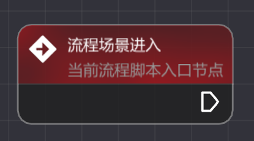

---

#### 2. 添加音频

背景音乐是环境氛围的基调。在流程图空白处 **右键 -> 音频播控 -> 音频播放** 创建节点。将资产视图中的 BGM 文件拖入节点的 **音频资产框**，调整适当的 **音量** 并设置 **淡入时间**，让音乐平滑进入。

  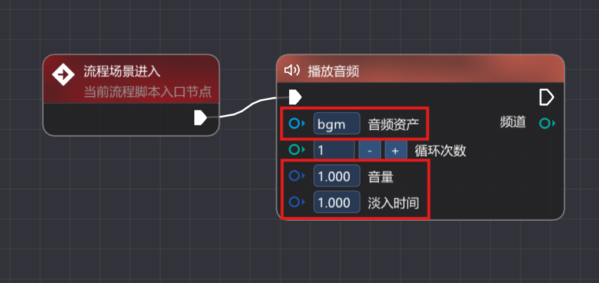

---

#### 3. 添加背景

接着搭建游戏画面主体。**右键 -> 演出控制 -> 切换背景图片** 创建节点。将纹理资源拖入节点，并勾选 **等待互动** 选项。这意味着画面会停留在背景处，给予玩家欣赏场景的时间，直到点击鼠标才会继续。

  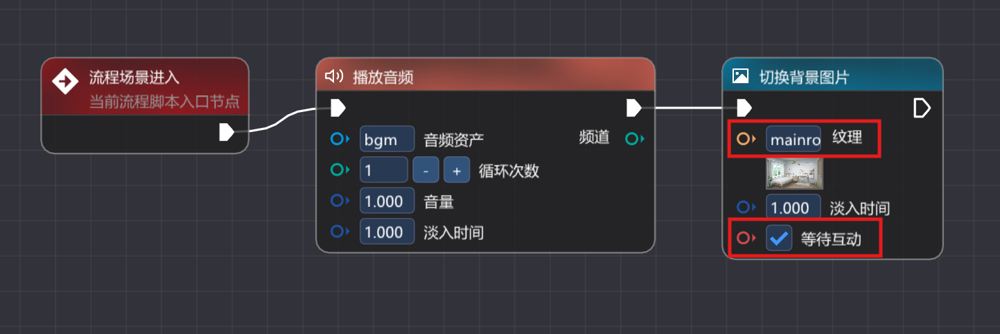
    
  

---

#### 4. 添加前景

背景就绪后让角色登场。**右键 -> 演出控制 -> 添加前景图片** 创建节点。拖入角色立绘 **纹理**，调整 **位置** 和 **缩放** 比例以适应画面，同样勾选 **等待互动** 来控制演出节奏。

  
    
  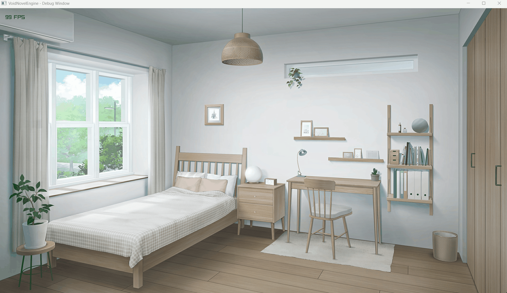

---

#### 5. 显示宽银幕遮幅

为了营造电影感或强调接下来的剧情，**右键 -> 演出控制 -> 显示宽银幕遮幅** 创建节点。上下黑边的出现可以迅速聚焦玩家的注意力。

  
    
  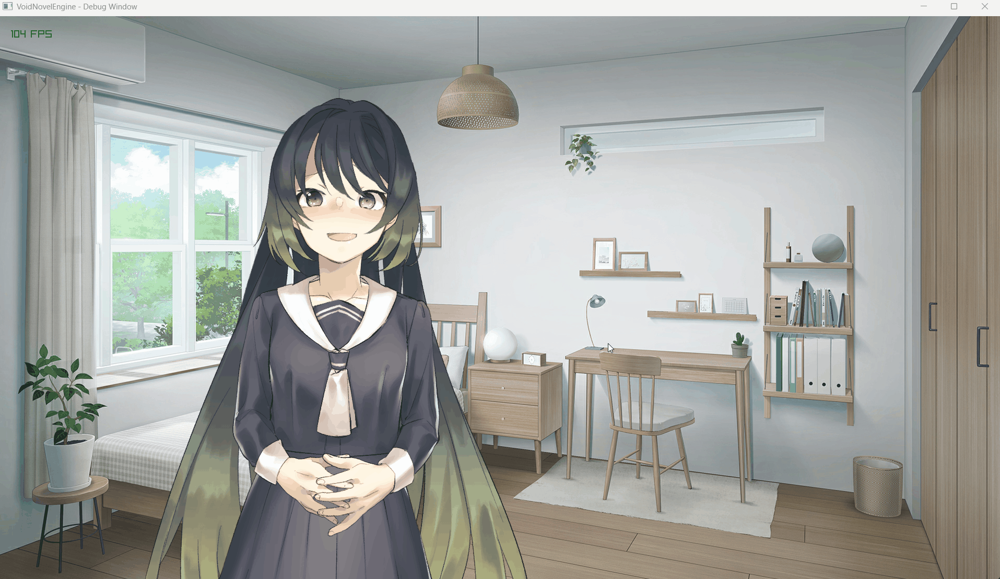

---

#### 6. 显示对话框

在宽银幕遮幅下弹出对话框。**右键 -> 演出控制 -> 显示对话框** 创建节点。此处需 **勾选等待互动** ，这代表着“等待玩家阅读完文字并点击”，随后才会触发后续的选项分支。

  
    
  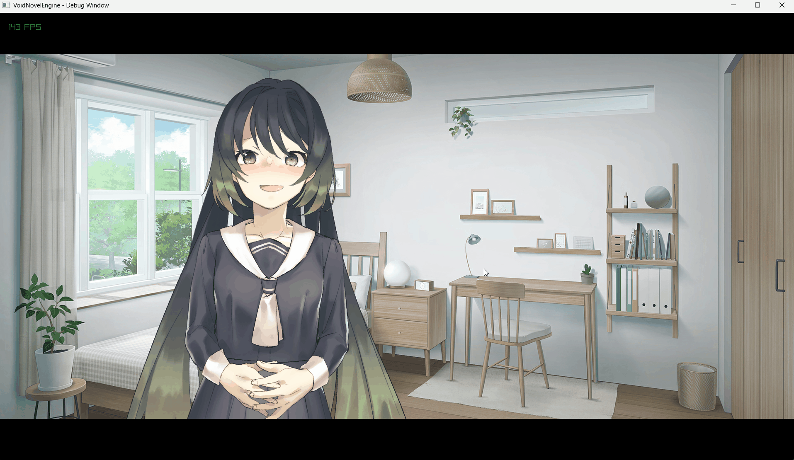

---

#### 7. 显示分支按钮

为了增加互动性，**右键 -> 演出控制 -> 显示分支按钮** 创建节点。在节点中填入不同的 **分支文本** 来描述选项。该节点会根据玩家的选择，从右侧 **不同的输出引脚** 激发后续逻辑，从而产生剧情分歧。

  
    
  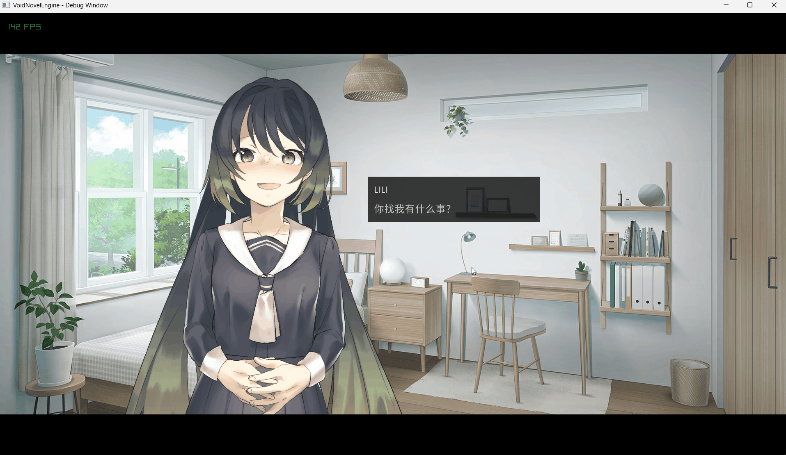

---

#### 8. 合并流程

无论玩家选择了哪个选项，我们都希望剧情最终回到同一条主线上。**右键 -> 其他 -> 合并流程** 创建节点，将分支按钮的多个输出流向汇聚连接到此节点的输入引脚上。

  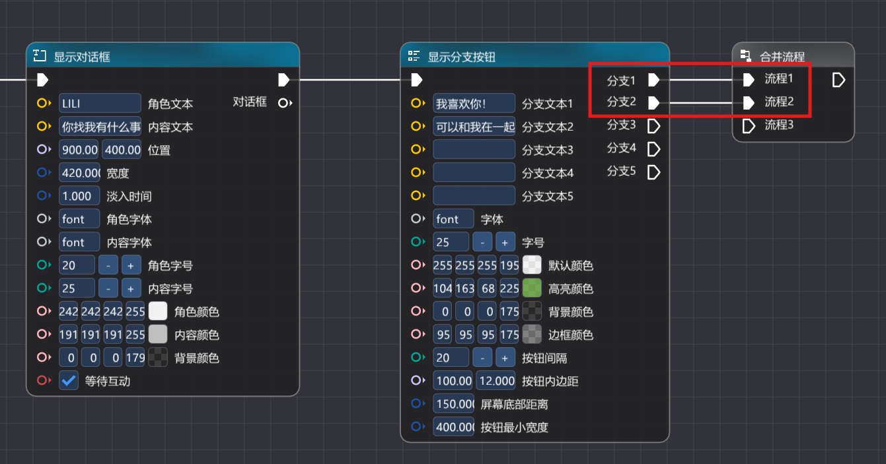

---

#### 9. 隐藏对话框

在显示新的内容之前，我们需要清理上一阶段的 UI。**右键 -> 演出控制 -> 隐藏对话框** 创建节点。注意观察，我们需要将步骤 6 中 **显示对话框节点** 右侧圆形的 **对话框引脚**，连接到此节点的 **对话框引脚**，来指明要隐藏的是哪个对话框。

  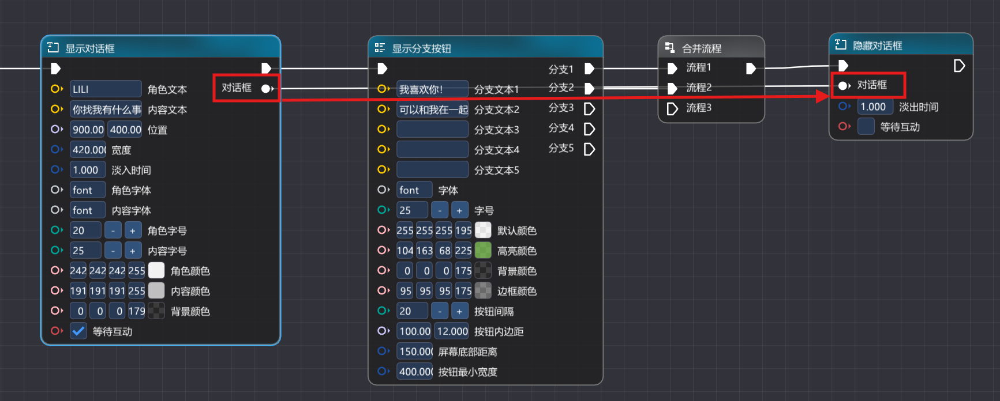

---

#### 10. 显示对话框

旧的对话框消失后，**右键 -> 演出控制 -> 显示对话框** 创建一个新的对话框节点，展示分支选择后的回应文本。这样可以避免 UI 堆叠，保证画面整洁。

  
    
  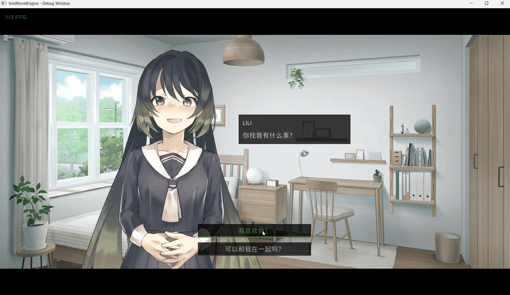

---

#### 11. 显示字幕

在宽银幕模式下，**右键 -> 演出控制 -> 显示字幕** 创建节点。配合之前的遮幅，能有效营造出内心独白或旁白的效果。

  
    
  

---

#### 12. 隐藏字幕

剧情即将结束，开始进行资源清理。**右键 -> 演出控制 -> 隐藏字幕** 创建节点，来清除屏幕底部的文字。

  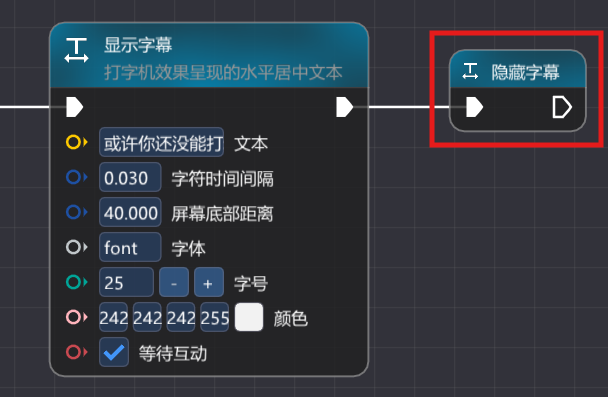

---

#### 13. 隐藏对话框

接着，**右键 -> 演出控制 -> 隐藏对话框** 创建节点。将**步骤** **10** 中的 **显示对话框节点** 的对话框引脚连接至此，确保当前屏幕上的对话框被正确关闭。

  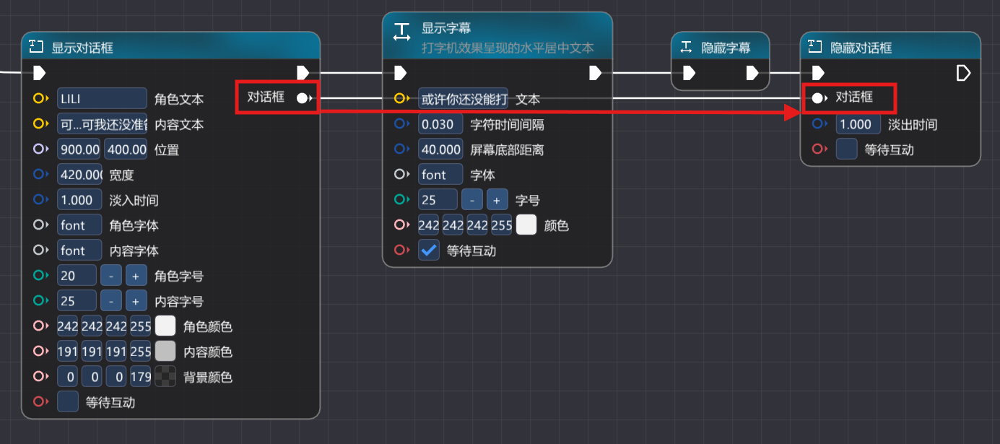

---

#### 14. 隐藏宽银幕遮幅

**右键 -> 演出控制 -> 隐藏宽银幕遮幅** 创建节点，让画面上下黑边退去，视野回归正常。

  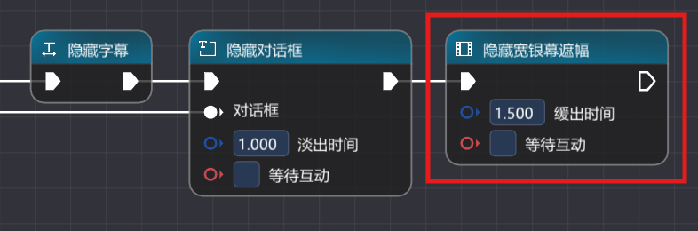

---

#### 15. 删除前景图片

最后让角色退场。**右键 -> 演出控制 -> 删除前景图片** 创建节点。找到**步骤** **4** 的 **添加前景图片** 节点，将其右侧的 **前景图片引脚** 跨越整个流程连接到此节点的 **前景图片引脚** 来删除该前景图片。

  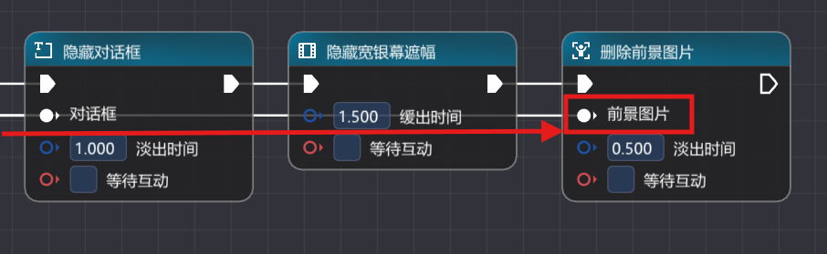

---

#### 16. 停止音频

视觉清理完毕后，听觉也需同步结束。**右键 -> 音频播控 -> 停止音频** 创建节点。将**步骤** **2** 中 **音频播放** 节点的 **频道引脚** 连接至此节点的 **频道引脚**，并设置一定的淡出时间，让音乐自然停止。

  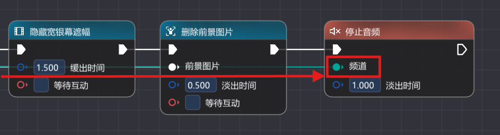

---

#### 17. 淡出转场

所有资源清理完毕，最后 **右键 -> 演出控制 -> 淡出转场** 创建节点。设置 **等待互动**，当玩家最后一次点击时，画面淡出至全黑，本段演示圆满结束。

  
    
  

---

## 试运行项目与结语

至此，您已经成功从零开始构建了一个具备开场、剧情分支以及完整谢幕逻辑的 AVG 游戏片段！它涵盖了 **VoidNovelEngine** 的流程控制与交互逻辑。但这仅仅是冰山一角，更多高级功能等待您在未来的创作中去发掘。期待看到大家用 **VoidNovelEngine** 创造出更多动人的故事！

---